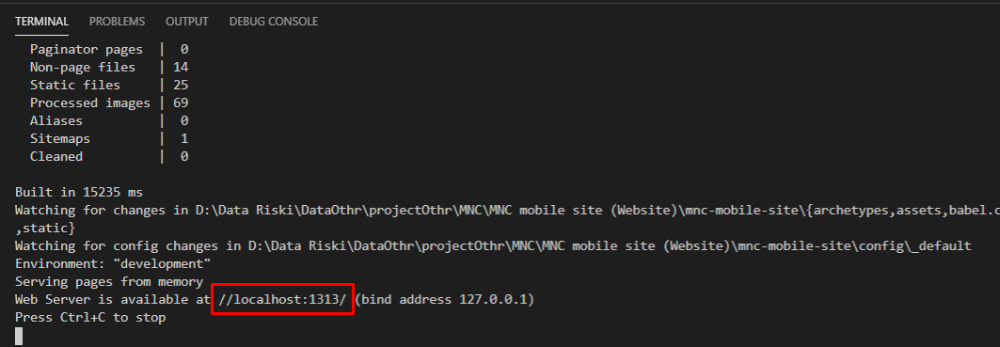
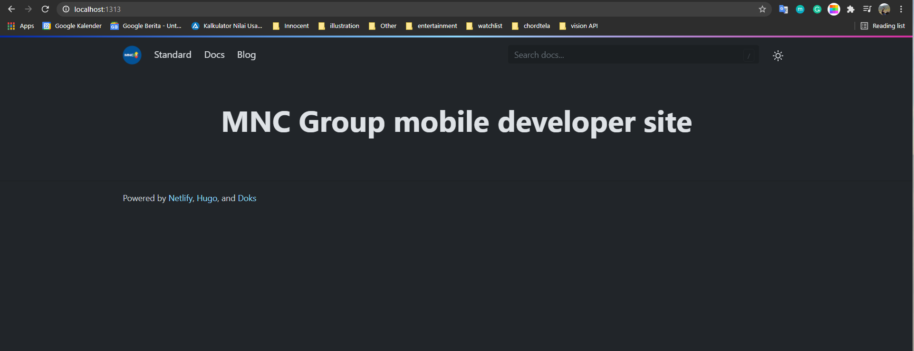
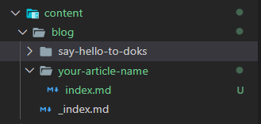
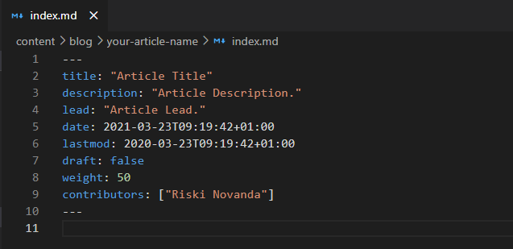
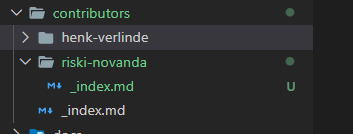

## Getting Started

Instructions for using the repository and creating content are provided below

### How To Install

1. Make sure you have npm installed on your local server / computer

2. Clone the repo
   ```sh
   git clone https://github.com/mncinnovation/mnc-mobile-site.git
   ```
3. Install the NPM package on this project
   ```sh
   npm install
   ```
4. Run on your local server
   ```sh
   npm run start
   ```
5. Copy the link and run it in the browser<br>
   
6. The project has been successfully executed on your local server<br>
   
   


### How Add Content
1. Create new folder and new file<br>
   
2. Write your content in index.md<br>
   
3. Don't forget to add your profile to the contributors folder<br>
   
4. Create new Branch 
   ```sh
   git branch your-branch-name
   ```
5. Checkout to your new branch 
   ```sh
   git checkout your-branch-name
   ```
6. Git add, git commit and git push 
   ```sh
   git add .
   git commit -m "your messages"
   git push --set-upstream origin your-branch-name
   ```
7. Pull request on Github
