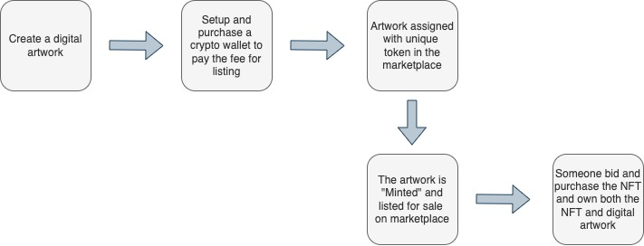
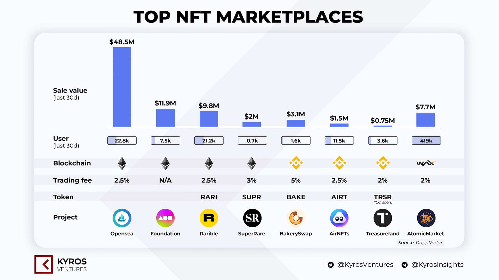

Indonesian College student Ghozali Ghozalo has created a viral NFT collection that has achieved massive trading volume in just days. Ghozali sells 933 selfies everyday from 2017-2021 (18-22 years old) as NFTs for $3 each and the collection's now worth millions. NFT’s are literally out here changing lives.

## So, What's NFT Anyway?
To understand NFTs, we first need to look at the two keywords in the name, Non-fungible derived from the words **Fungibility** and **Token**.

**Fungibility** is the ability of an asset to be exchanged or replaced with a similar asset that has the same value.  For example, you can exchange a Rp100,000 for two of Rp50,000 and the value remains the same.

Meanwhile, a **token** is a digital asset that represents goods, services, or other forms of value.

_Illustrated by_ [learningcryptos.com](https://learningcryptos.com/wp-content/uploads/2021/04/What-is-a-Non-Fungible-Token_2.svg)

So, **Non-Fungible Tokens (NFTs)** are digital assets that represent valuables with a value that cannot be replaced or exchanged. Each NFT has transaction record data inside the blockchain. This data contains who the creator is, the price, and ownership history.

## How it's work?

In terms of Ghozali, he minted the artwork(selfie photos) on NFT marketplace. Here's the flow

    Minting: it means converting it into tokens. To mint you have to pay some gas free. For that you have to create a crypto exchange account.
 
 Ghozali minted at [OpenSea](https://opensea.io/collection/ghozali-everyday). Everyone can buy and sell NFTs in many marketplaces. These digital markets offer NFTs in many forms. The crypto assets used to buy NFTs usually depend on the platform we choose. For example, CryptoPunks, OpenSea and Rarible only accept payments using Dollars and ETH. But, sites like NBA Top Shot provide the freedom for their users to pay using some type of crypto asset.

_Source:_ [Kyros Ventures](https://kyros.ventures/)

### NFT Business

The inevitable part of any trading of assets comes with the ability to hold and protect the ownership of the asset. With the combined prowess of NFTs and blockchain technology, it is completely possible to do more abilities.
- NFT for Art: NFTs offer artists the ability to self-manage intellectual property, and participate in a new business model that incentivizes fans to monetize an artist in a new way.
- NFT in Metaverse: In the metaverse, the avatar will have land and buildings. These assets must be tracked who owns them. and also, clothing, vehicles, and other items may be trade or sell like the real world.

### Trying to turn artwork into a NFT

We're in MNC Innovation Center trying to explore the tech behind the NFT. We're finding out how NFTs actually happen and how it's work. This exploration will focus on the process of making an artwork into an NFT and selling on the marketplace.

#### Prepare the artwork