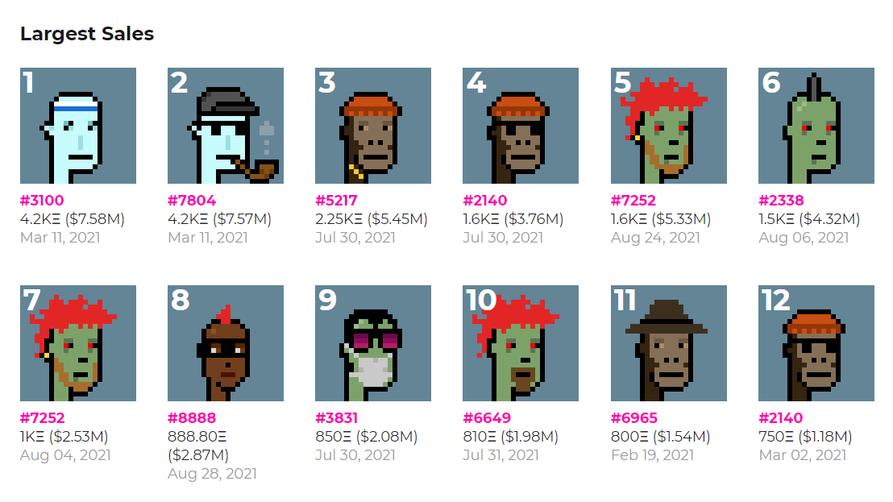
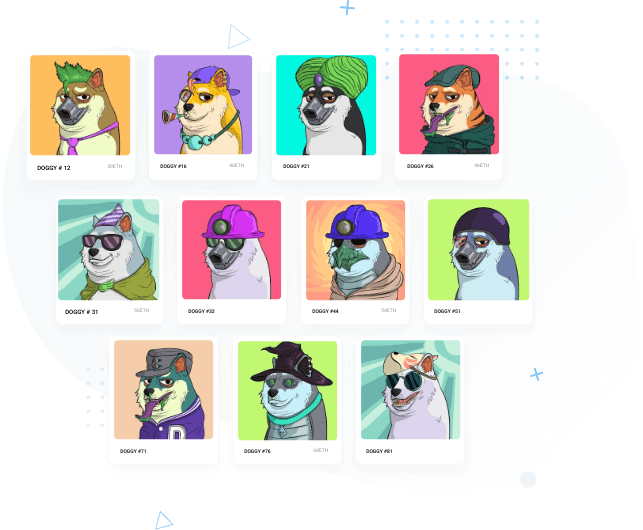
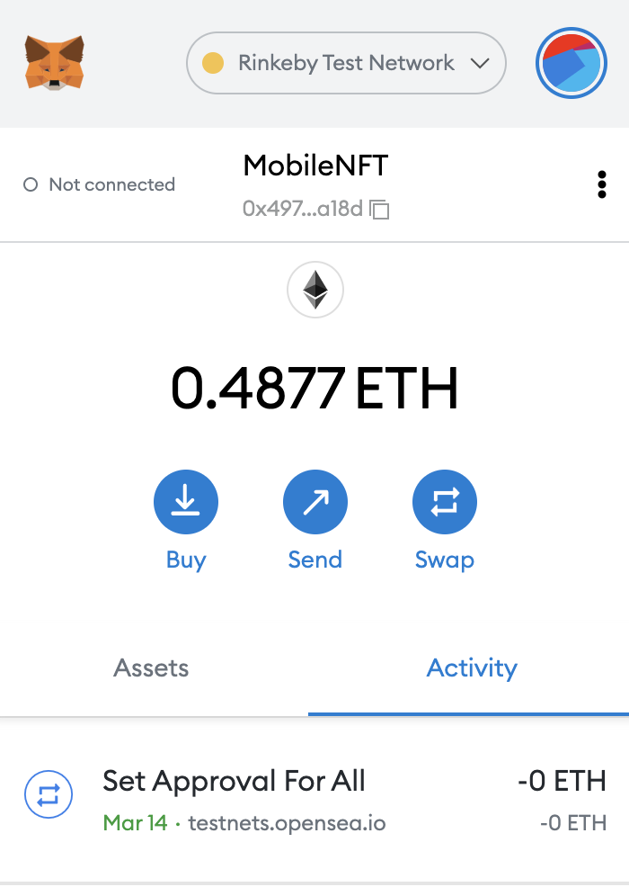
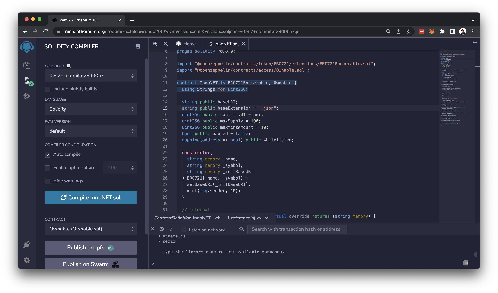
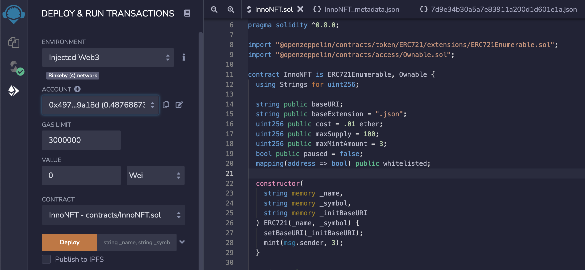
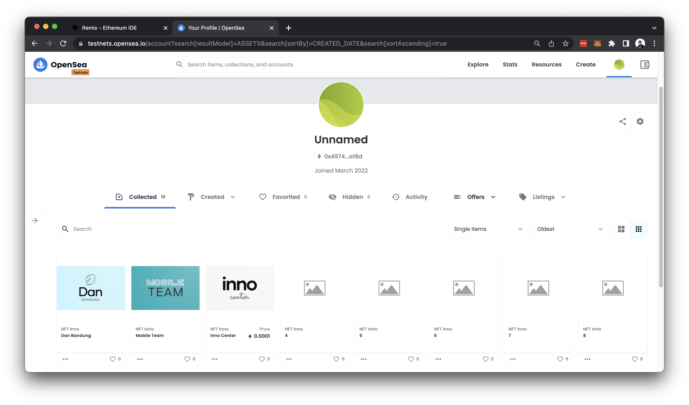
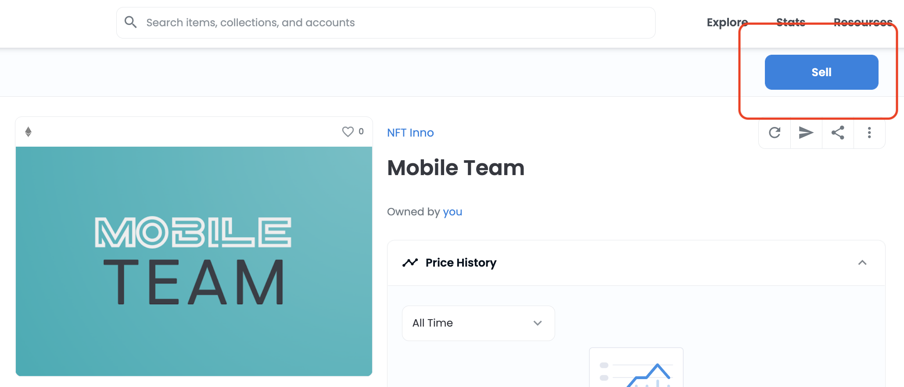
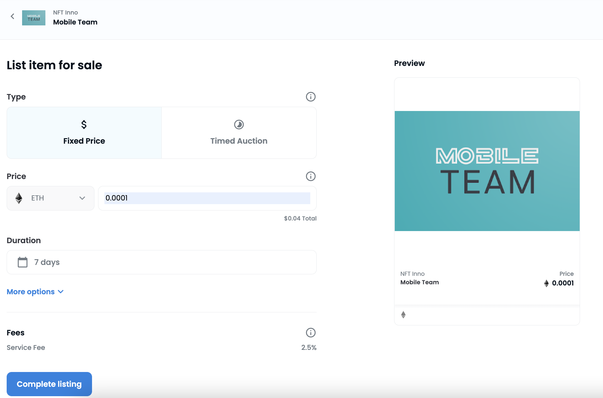

Indonesian College student Ghozali Ghozalo has created a viral NFT collection that has achieved massive trading volume in just days. Ghozali sells 933 selfies everyday from 2017-2021 (18-22 years old) as NFTs for $3 each and the collection's now worth millions. NFT’s are literally out here changing lives.

## So, What's NFT Anyway?
To understand NFTs, we first need to look at the two keywords in the name, Non-fungible derived from the words **Fungibility** and **Token**.

**Fungibility** is the ability of an asset to be exchanged or replaced with a similar asset that has the same value.  For example, you can exchange a Rp100,000 for two of Rp50,000 and the value remains the same.

Meanwhile, a **token** is a digital asset that represents goods, services, or other forms of value.


_Illustrated by_ [learningcryptos.com](https://learningcryptos.com/wp-content/uploads/2021/04/What-is-a-Non-Fungible-Token_2.svg)

So, **Non-Fungible Tokens (NFTs)** are digital assets that represent valuables with a value that cannot be replaced or exchanged. Each NFT has transaction record data inside the blockchain. This data contains who the creator is, the price, and ownership history.

## How it's work?

In terms of Ghozali, he minted the artwork(selfie photos) on NFT marketplace. In general, here's the flow :


    Minting: it means converting it into tokens. To mint you have to pay some gas free. For that you have to create a crypto exchange account.
 
 Ghozali minted at [OpenSea](https://opensea.io/collection/ghozali-everyday). Everyone can buy and sell NFTs in many marketplaces. These digital markets offer NFTs in many forms. The crypto assets used to buy NFTs usually depend on the platform we choose. For example, CryptoPunks, OpenSea and Rarible only accept payments using Dollars and ETH. But, sites like NBA Top Shot provide the freedom for their users to pay using some type of crypto asset.

_Source:_ [Kyros Ventures](https://kyros.ventures/)

### NFT Business

The inevitable part of any trading of assets comes with the ability to hold and protect the ownership of the asset. With the combined prowess of NFTs and blockchain technology, it is completely possible to do more abilities.
- NFT for Art: NFTs offer artists the ability to self-manage intellectual property, and participate in a new business model that incentivizes fans to monetize an artist in a new way.
- NFT in Metaverse: In the metaverse, the avatar will have land and buildings. These assets must be tracked who owns them. and also, clothing, vehicles, and other items may be trade or sell like the real world.

### Trying to turn artwork into a NFT

We're in MNC Innovation Center trying to explore the tech behind the NFT. We're finding out how NFTs actually happen and how it's work. This exploration will focus on the process of making an artwork into an NFT and sell.

#### The Artwork 

After looking at several popular NFTs, most of them have the same pattern of creating several examples of different artwork based on the layers provided. 


Popular tool used to create multiple different instances of artworks based on provided layers is [HashLips Art Engine](https://github.com/HashLips/hashlips_art_engine). But actually we can also make it from paintings or sketches.

#### Metadata

NFT metadata is the core of an NFT. It is a JSON document that often contains the following:
- NFT’s name
- Description of the NFT
- Link to the hosted image
- Traits, and many more..


source: [https://docs.opensea.io/docs/metadata-standards](https://docs.opensea.io/docs/metadata-standards)

This would be a real example of an NFT metadata:
```{
    "description": "Galaxy & stars photos",
    "external_url": "https://www.pexels.com/photo/milky-way-galaxy-during-nighttime-1252890/",
    "image": "https://gateway.pinata.cloud/ipfs/QmZ6iJbUpEfKxUodwx4DgaF9zquvRjJEMXAkH8EJtWPLKm",
    "name": "Starry Night #1",
    "attributes": [
        {
            "trait_type": "Author", 
            "value": "Hristo Fidanov"
      },  
      {
            "trait_type": "Camera", 
            "value": "NIKON D750"
      }, 
      {
            "trait_type": "Resolution", 
            "value": "6016px x 3385 px"
      }, 
      {
          "display_type": "date", 
          "trait_type": "Published", 
          "value": 1531951200
      }
]
}
```

#### Smart Contract

A smart contract is programming that exists within the blockchain. This enables the network to store the information that is indicated in an NFT transaction. Once done this information can be accessed when needed. The smart contract also ensures that the information stored is transparent as well as immutable. 

NFTs are run by smart contracts which govern the various actions such as: 
- Verifying the ownership 
- Handling the transferability

Since Ethereum is the most used NFT. The standards in Ethereum is [ERC 721](https://ethereum.org/en/developers/docs/standards/tokens/erc-721/). 

ERC721 standard defines the workings of a smart contract. When a token is transferred they need 2 pieces of information: 
- Address of Smart Contract 
- ID of the Token

Not sure where to start? try to visit [OpenZeppelin](https://docs.openzeppelin.com/contracts/4.x/wizard)

If you don't want to preinvent the wheel, actually some of creator or community share the NFTs smart contract on public like [NFT Minter from HashLipz](https://github.com/HashLips/example_nft_minter/blob/main/contracts/SmartContract.sol)

All we need is learn how it's work and make sure it fits with what we need.

##### Digital Wallet

Next, We will need a digital wallet that allows you to send and receive transactions. The most popular wallet these days is [Metamask](https://metamask.io/).


##### Tools

Since we're try to developing, deploying and administering smart contracts for Ethereum network, [Remix Project](https://remix-project.org/) is one of community and tools for us to learn. 

Smart contracts implemented using high-level language called [Solidity](https://docs.soliditylang.org/en/v0.6.1/index.html). Solidity was influenced by C++, Python and JavaScript and is designed to target the Ethereum Virtual Machine (EVM).

 Deploying a smart contract directly on the mainnet is not ideal. We need to test the smart contracts on the local blockchain development network first. 
 
 We're using [Remix IDE](https://remix.ethereum.org/). They have a compiler to check for errors. They offer a wide variety of deployment options. We can deploy it on Javascript-based Virtual Machine, Injected Web3 for MetaMask, and local blockchain network.
 

 #### NFT Minting

 After create a smart contracts, we deploy that to testnet. Testnet is an alternative blockchain to be used for testing. 
 

 As defined on constructor. Once you deploy the smart contracts, it will create a token as much as you define mint amount.
 

 visit [testnet.opensea.io](https://testnets.opensea.io/0x49744984cb281a608d9f84f1837ed796dec9a18d) to check the collection that has been minted. It takes some minute to load the metadata.

 If we want to mint another NFTs, we can use existing public function to minting the new one.
 ```
  function mint(address _to, uint256 _mintAmount) public payable {
    uint256 supply = totalSupply();
    require(!paused);
    require(_mintAmount > 0);
    require(_mintAmount <= maxMintAmount);
    require(supply + _mintAmount <= maxSupply);

    if (msg.sender != owner()) {
        if(whitelisted[msg.sender] != true) {
          require(msg.value >= cost * _mintAmount);
        }
    }

    for (uint256 i = 1; i <= _mintAmount; i++) {
      _safeMint(_to, supply + i);
    }
  }
  ```

Token has been minted and the NFTs been loaded from metadata. To sell it, go to detail page of the item and click blue button with title _"Sell"_

after that, complete all the fill and finish by click on _"Complete Listing"_ button. 

 ## Conclusions

 Non-Fungible Tokens (NFTs) basically are unique pieces of data that are stored on a blockchain. in this case we're minting a picture of typography, but another digital art, music, video clips, and tickets is some of items that can be converted as NFTs.

 All exploration in the article generally related to develop a Decentralized applications (dApps) with NFT marketplace as a usecase. We can create an application built on a decentralized network that combines a **smart contract** and a **frontend user interface** for another usecase. On music or movie sector, NFT will be certified the ownership of a unique musical work that can be sold to another party. And also, In-game NFTs give players the opportunity to have in-game assets to trade with cryptocurrencies. There is also the term "play to earn", NFT game players will collect in-game assets or rewards that can later be converted into real cash.