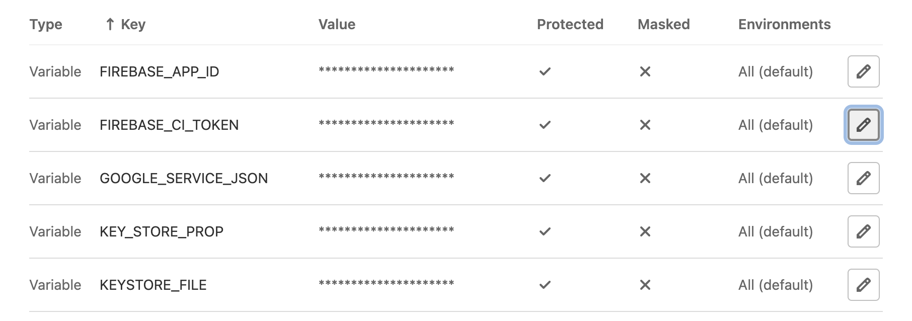
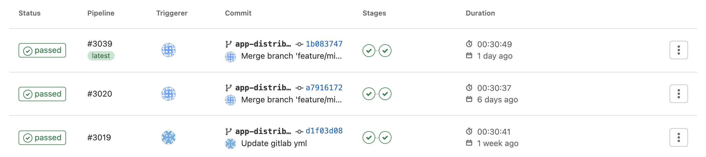
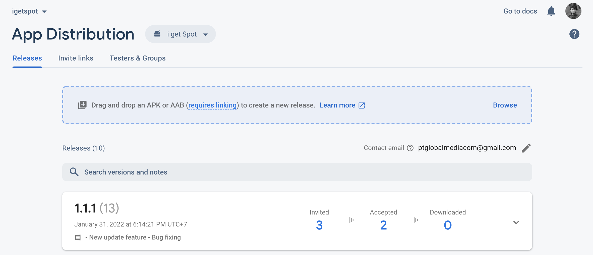

It is undeniable, the build process of an application often **spends a lot of time** in developing an android application, especially if the scope of existing features is quite large. **CI/CD** can automate the process even to the distribution of APK(s) to testers. **Continuous Integration (CI)** is one of the most common development practices used in software development by enforcing automation in building. **Continuous delivery (CD**) is the step after Continuous Integration, used to deploy or distribute the applications.

**GitLab** has a simple and free CI/CD system that can automate the build, test, and deploy processes that can be applied to our apps. In this article, I will explain how to setup Android CI/CD configuration in GitLab repository, with the final goal is deploying the APK(s) to **Firebase app distribution**.

## Signing Config

Prepare the keystore that was previously created, create a file `key.properties` to save the credentials data of the keystore. Don't forget to add the file to `.gitignore`.

    storePassword=<your_store_password>  
    keyPassword=<your_key_password>  
    keyAlias=<your_key_alias>
    storeFile=<your_kestore_location_file>

Then change the signing config in the **gradle app** by pointing to the `key.properties` file just created.

    def keystoreProperties = new Properties()  
    def keystorePropertiesFile = rootProject.file('key.properties')  
    if (keystorePropertiesFile.exists()) {  
        keystoreProperties.load(new FileInputStream(keystorePropertiesFile))  
    }
 
Add the following script in the `android` section :

    signingConfigs {  
      file(rootProject.file('key.properties')).with { propFile ->  
		   if (propFile.canRead()) {  
                config {  
				    keyAlias keystoreProperties['keyAlias']  
                    keyPassword keystoreProperties['keyPassword']  
                    storeFile file(keystoreProperties['storeFile'])  
                    storePassword keystoreProperties['storePassword']  
                }  
		    }  
            else {  
                print('not signed')  
            }  
        }  
    }

Then, add the following script to the `defaultConfig` section :

    file(rootProject.file('key.properties')).with { propFile ->  
      if (propFile.canRead()) {  
            signingConfig signingConfigs.config  
        }  
    }

For more details how to signing config, you can visit: https://developer.android.com/studio/publish/app-signing.

## Store as Variable

To protect sensitive data and information, we can store it as variable in Gitlab CI/CD settings. For files like keystore, `key.properties` dan `google-services.json`, we can convert them to base64 encoding first before store to variabel.

> Settings > CI/CD > Variables

For more details how to get firebase ci token, you can visit: https://firebase.google.com/docs/cli.

## Gitlab CI/CD Pipeline

GitLab CI/CD pipelines are configured using a YAML file named `.gitlab-ci.yml` in the root of the project folder. The configuration file consists of several tags :
- **Image**, to define a Docker Image that will be used for execution in CI/CD Jobs.
- **Variable**, is to set a value to a variable used during script execution.
- **Before Script**, used to initialize setup or define the command that should be run before main script execution.
- **Cache**, to specify a list of files and directories to cache between jobs.
- **Stages**, is to defines the order of job stage for pipeline.
- **Stage**, used to specify the stages of work in progress, the pipeline will execute all stages with the same name first.
- **Only**, is to applied only when there is a push on a specific branch.
- **Script**, is to execute the main script where we build or sign the application, with the credentials previously stored in a variable.
- **Artifacts**, used to store or upload the file (APK) and passed to the next job and are also available for download from repo.

We can add CI/CD configuration to any branch we want. In my case, I create a new branch with the named `app-distribute` to run the pipeline.

### Build Stage

Here is the workflow build script for the debug  :

     assembleDebug:
      stage: build
      only:
        - app-distribute
      script:
        - ./gradlew assembleDebug.

Meanwhile, here is the workflow build script for the production release :

    assembleProductionRelease:
     stage: build
     only:
     - app-distribute
     script:
     - echo ${GOOGLE_SERVICE_JSON} | base64 -d > app/google-services.json
     - echo ${KEY_STORE_PROP} | base64 -d > key.properties
     - echo ${KEYSTORE_FILE} | base64 -d > app/keystore.jks
     - ./gradlew assembleProductionRelease
     artifacts:
     expire_in: 7 days
     paths:
     - app/build/outputs/apk/production/**/*.apk

It's free to change depending on your needs.

Sometimes the Docker Image OpenJDK script from Gitlab CI has problems because the license of the Android SDK changes causing the build to fail. An alternative is to use [jangrewe's](https://github.com/jangrewe/gitlab-ci-android) prebuild Docker Image

### Deploy Stage
You need to create a tester group first in the firebase console, then add the update notes file (`release-notes.txt`) in the root of the folder structure.

    deployFirebaseProduction:
     image: node:latest
     stage: deploy
     before_script:
     - export GRADLE_USER_HOME=$(pwd)/.gradle
     - export JAVA_HOME="/usr/bin/java"
     - apt-get update -y && apt-get install wget -y
     dependencies:
     - assembleProductionRelease
     only:
     - app-distribute
     script:
     - npm install -g firebase-tools
     - if [ -f "app/build/outputs/apk/production/release/app-release.apk" ]; then firebase appdistribution:distribute app/build/outputs/apk/production/release/app-release.apk --app $FIREBASE_APP_ID --release-notes-file release-notes.txt --groups "gitlab-group" --token "$FIREBASE_CI_TOKEN"; fi

### Implementation

This is the sample script of how I implement Gitlab CI/CD in one of the android projects in the MNC Repo.

Full script of yaml can be found [here](https://mnc-repo.mncdigital.com/-/snippets/10).

## Conclusion

To make it easier for a mobile developer from build APK repeatedly, I think CI/CD can be applied, especially in developing android mobile applications in the MNC Repo. Some other better alternative tools such as Codemagic might also good, but they need more cost. So far, Gitlab CI/CD on the MNC Repo is better. However, the MNC Repo has a limit on the size of the uploaded APK(s).
