### Introduction
Innovation for mobile application development is move faster. Year to year there are a new trends, these last few years ``declarative UI`` become the new trend in mobile development. Dart for framework Flutter, SwiftUI for native iOS, and there are Jetpack Compose for native Android.

Jetpack Compose is Android modern toolkit for building native UI. It simplifies and accelerates UI development on Android.

As we know Jetpack Compose has been announced at Google I/O 2019, but still on development. In the middle of 2020, there are Compose versi 0.1.0-dev09, google not release compose yet. Until at 2021, 28 July Compose is release stable version 1.0.0. I think Google is so seriuos to develop Jetpack Compose, they need 2 years to release stable version since announced at Google I/O 2019. This tool have a mission to make it easier for developers to create responsive UI with more concise code.

### Why Adopt Compose
We adopt compose because it have some advantage for our code. Take a look at four pilar of Jetpack Compose.

- Less Code
    
    By using compose, we can create app with less code. For example if we need to create list view with custom item view, with tradional method (XML-way) we have to declare RecyclerView and also adapter of RecyclerView first. But with compose we just create custom item view function and call it at component list (LazyColumn / LazyRow), it will use less than 20 lines of code. 
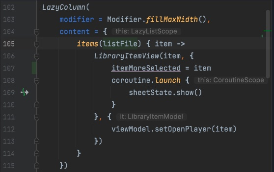

- Intuitive

    Compose uses declarative API, which means that all we need to do is describe our UI, compose takes care of the rest. As app state changes, our UI automatically updates. The APIs are intuitive - easy to discover and use.

- Accelerate Development

    Not only easy to use, compose is compotible with all of our existing code. It means we can call compose code from Views and Views from Compose.
    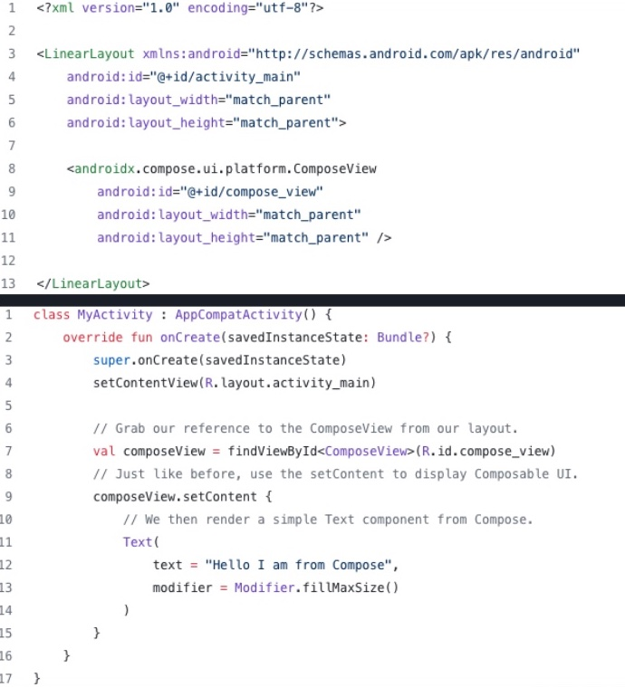

    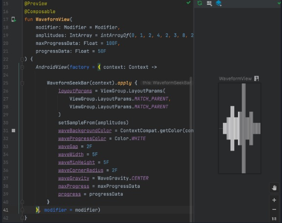

    So don't worry about compatibility, you can start to use Jetpack Compose whenever you want.

- Powerfull

    Enables to create apps with direct access to the Android platform APIs and built-in support for Material Design, Dark theme, animations and more.

#### Fundamental Jetpack Compose

##### How to Start Jetpack Compose
To start with Jetpack Compose is simple.
- New Project

    If you start from new project, you can select ``Empty Compose Activity`` to make Android Studio init project with compose.

- Existing Project

    If you want to add to existing project. Open ``app.gradle`` then add code to enable compose and some dependencies for compose like below.
```groovy
android {
    buildFeatures {
        compose true
    }
    composeOptions {
        kotlinCompilerExtensionVersion kotlinCompiler_compose_version
    }
}
dependencies {
    
    //compose component
    implementation "androidx.compose.ui:ui:$compose_version"
    implementation "androidx.compose.material:material:$compose_version"
    implementation "androidx.activity:activity-compose:$compose_activity_version"
    implementation "androidx.compose.runtime:runtime-livedata:$compose_version"
    //preview compose ui
    implementation "androidx.compose.ui:ui-tooling-preview:$compose_version"

    debugImplementation "androidx.compose.ui:ui-tooling:$compose_version"
    debugImplementation "androidx.compose.ui:ui-test-manifest:$compose_version"
}
```

##### Thinking in Compose
What we need to understand at the beginning is how we can thinking in Compose that have a different way from traditional ui view.

If we usually do in ui view is define the UI of the layout (xml), then call it using view bindings on the activity/screen and then fill it with the data or add events to the UI directly there too. 

In Compose we use declarative UI whichs is arranged like a tree, from the top to the bottom of the widget.

For the data let's take a look at the picture below.

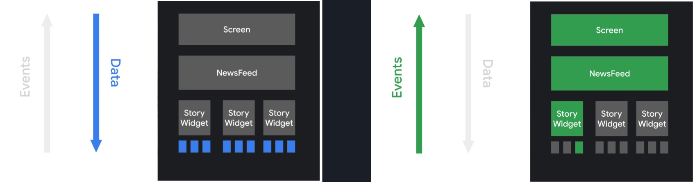

In compose the logic of this app is on the screen that will provide data to the lowest hierarchical component.

When there's a change in one widget, for example in the story widget index to 0, there is an event that must update the state, this process is for widget index 0 only.

##### Jetpack Compose Component
- Composable Function

    Every widget with compose, defined with @Composable in function.

- Standard Layout Components (Box, Column, Row)

    There are three main layout component in compose.
    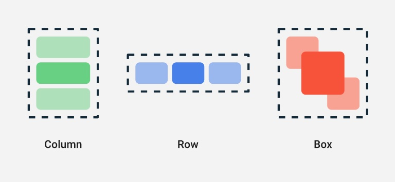

    1. Box : Like stack, first widget will placed at behine second widget. In xml-way like RelativeLayout
    2. Column : Like LinearLayout with orientation vertical in xml-way.
    3. Row :Like LinearLayout with orientation horizontal in xml-way.

- Foundation
    | XML-way | Compose |
    |-----|-----|
    | ``Button`` | ``Button`` |
    | ``TextView`` | ``Text`` |
    | ``ImageView`` | ``Image`` |
    | ``EditText`` | ``TextField`` |
    | ``LinearLayout vertical`` | ``Column`` |
    | ``LinearLayout horizontal`` | ``Row`` |
    | ``RelativeLayout`` | ``Box`` |
    | ``RecyclerView`` | ``LazyColumn`` for vertical list, ``LazyRow`` for horizontal list |

- Theme
    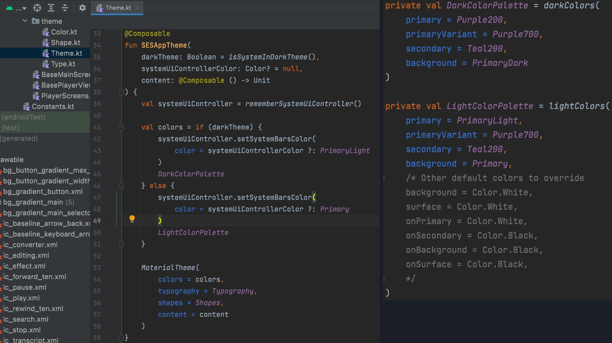

    For theme in compose is look like picture above. 
    You can modify theme of app here. If we create project with compose, we will meet Theme in kotlin code which is @Composable with ``MaterialTheme``. 

- Modifier
    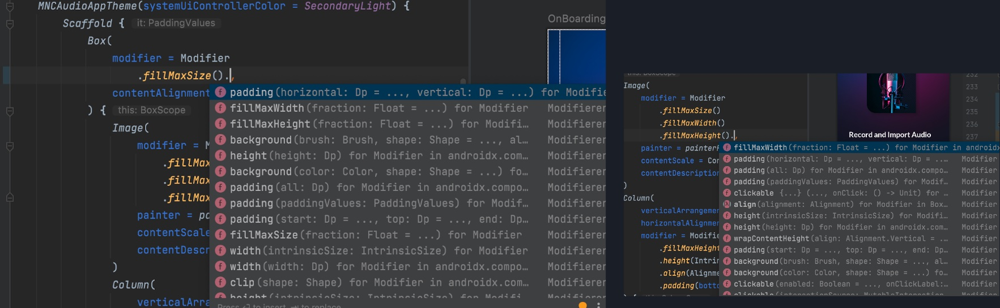

    Modifier is an optional object to manipulating or edit widgets. All of widget like Text, Button, Column, Row, Box etc have parameter modifier. I think this is powerfull because make us easy to modify any widget.

- State

    As we know, state is important for every apps that we need to update UI when data has changed.
    In Compose we need to use calculation state (mutableState) and ``remember`` to save the latest value.

    ``remember`` : to store data at local memory compose (cache of result computation), will gone or back to initial state when configuration has changes.
    ``rememberSaveable`` : same as ``remember`` but will save data in bundle and restored automatically when configuration has changed (for example by rotate the device).
    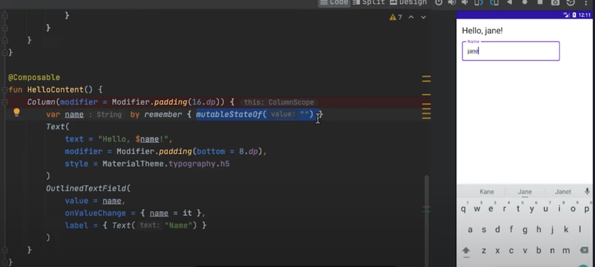

    This is sample of state at compose. If we input name at ``OutlinedTextField``, the value of state name will replaced with the new value on onValueChange and will shown at ``Text``.

    If we want to create better state implementation. We can placed the ``remember`` or state in State Holder like sample at below.

    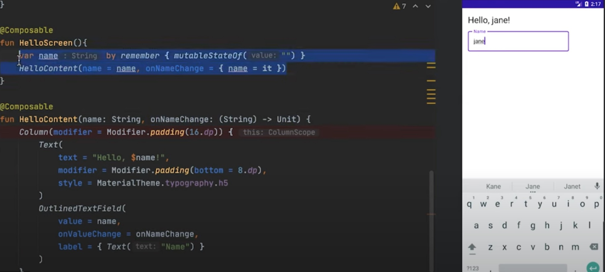

    For better implementation we split the content view with state. We can create one function ``Composable`` to call the content view and receive state changes, in the sample above is ``HelloScreen``.

    How if we want to implement state with ``ViewModel``?

    So simple. 

    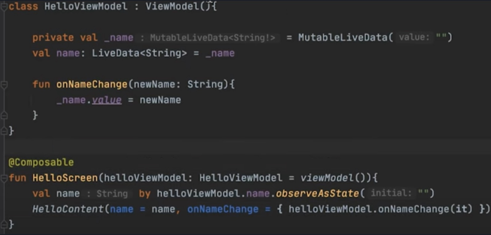

    Same as sample above, and for view model we can use ``LiveData`` to observe as state in compose.
    Just placed the viewModel parameter at function and call live data variable.

    Below is the architecture of android with Jetpack Compose is will look like.

    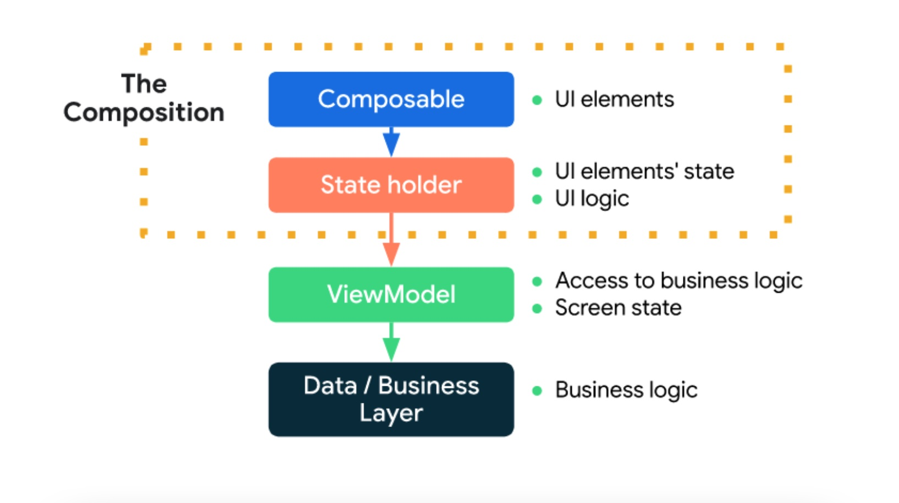

#### Pros of using Jetpack Compose

- Increase development speed. 

    Based on development for phase 1 SES Inno Audio Editor, it takes about 15 days to completed UI development, with some logic, research for custom and tricky UI included like trimming and waveform.
    
    

- Removes the boilerplate of findViewById or ViewBinding references.

- Not only for Android.

    Jetpack compose is a multiplatform solution. It's available for dekstop and web too.


#### Cons of using Jetpack Compose
- Preview Issues. 

    Preview is great, it's like better than XML one as it provides the ability to view (event interactive) previews with mocked data. But the downside of this solution is re-rendering preview each time code will change and builds are not that fast.

- Some components are "on the way"

    You can see Jetpack Compose [Road Map](https://developer.android.com/jetpack/androidx/compose-roadmap) for details. 


### Conclusion
    
By using Compose will increase the development speed with less code and easy to use. Compatible with existing project that use xml-way on layouting. In my opinion, Jetpack Compose is the future of Android UI development and we must adopt fastly. As long as I use compose, I enjoy with it and have never encountered any significant problems. So, I recommended it and we can adopt compose for new standard of Android Development.