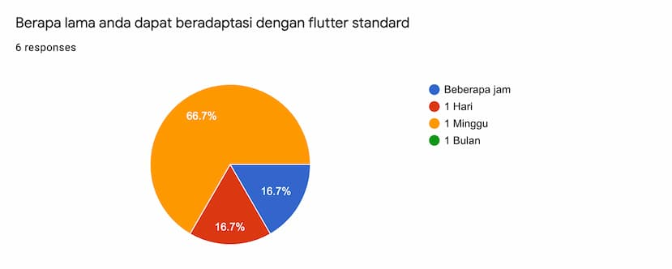

Since code are produce inside MNC, or from outsource in last couple of years there are several problems in mobile development MNC group that happened

- Unmaintainable code
- Harder to handover

It can lead to

- Rewrite code, add more time to writing existing feature, rather than add new value to product.
- Developer frustration, less productive since code harder to maintain.

The main reason for the above is that developers are forced to write code in a way they don't understand, which makes it harder to maintain the code later on, But what is the problem? What we need to do in order to solve this issue? The main goal of mobile application development is user experience and performance. If we can't do this, we will not be able to build a good product.

## Code Standard

What is standard
Standard are set of policies that developer should follow to ensure that we can write good code. to helps maintain the code and make sure that don't break anything else in mobile application development process, Mobile application development is a team work, so we should follow the standard to avoid any conflict between developers.

### Standard in MNC

Currently we have standards in MNC group, standard for android, iOS and flutter, with these goal

- Maintainable project
- Clear structure
- Clear workflow
- Easy to handover
- Increases Productivity
- Every standard has

Project Structure Standard

- Best Practice
- Security Standard
- Layout Standard
- Third Party Standard
- Documentation Standard

You can check current standard in standard section

## How its going

After implement this policy to every new flutter mobile project and we took survey.

### About responders

We ask to mobile developer from MNC employee and non MNC employe from across projects, since some project are produce by MNC partners.

### Responders experience using flutter

Responders are new flutter developer, will it harder to implement the policy?

### Is it harder to implement code standard?

We found that most developers are easy to implement it. since standard are designed to be new developer friendly.

### Is the documentation hard to understand

documentation are easier to understand.

### How long it took to adapt new standard

at least need a week for developers to adapt new standard

### Is it hard to maintain

We found that most developer maintain code, while minority developers hard to maintain the code

### Change behaviour

all developer will check and recheck documentation to comply to standard

## Conclusion

Code standard are solution to unmaintainable code,  After implement code standard policy in every new MNC project among new developer developers are easy and comply to code standard. even when developer are code using other developer code.
