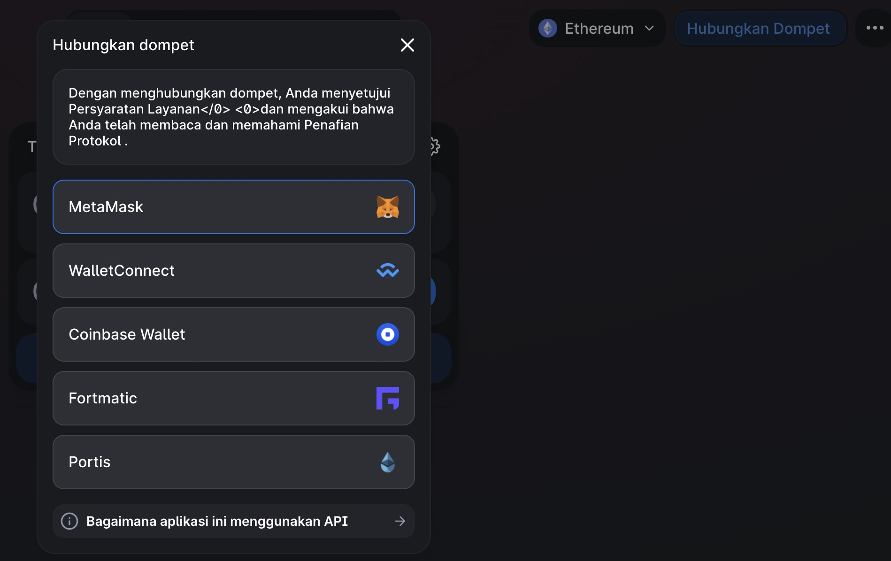
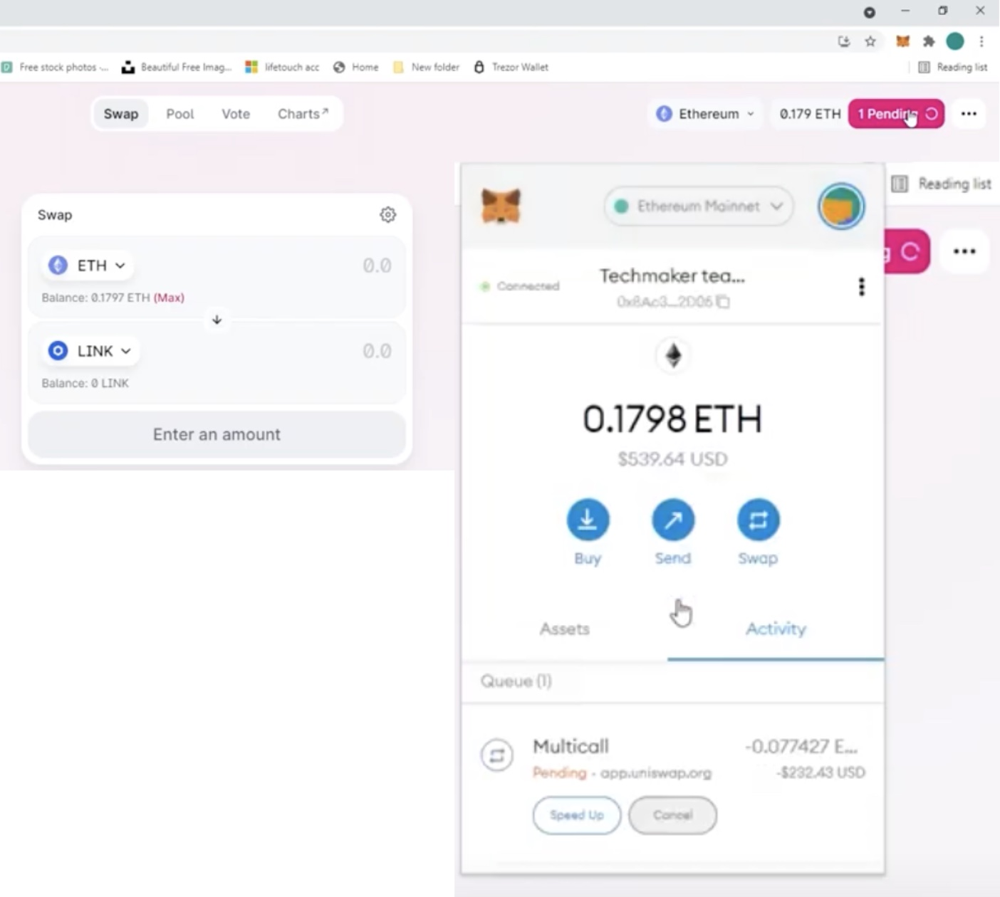

The massive success of the crypto industry largely depends on innovation. Crypto has transformed the economy in various ways while driving simplicity and profit. The seamless procedures of managing, accessing, storing, and purchasing digital assets have directly improved customer satisfaction and eliminated several complexities that accompanied the emerging sector. Token swaps were designed to reduce the overhead cost and the time required to swap one crypto asset for another. 
Let’s dive in deep

#### Token Swap
Token swap is a process in which one cryptocurrency is exchanged for another at a predetermined value.

There are many exchange services on the market that allow users to buy and sell cryptocurrencies for traditional currencies or for other cryptos. 

However, due to the limited liquidity and number of trading pairs on each exchange, users that want to trade directly between two crypto tokens are sometimes unable to do so.

For some exchanges, instead of a direct trade, users are forced to include the intermediate step of converting into and out of fiat money or one of the most popular cryptocurrencies, such as BTC or ETH.

What is Fiat currency?

Fiat currency is “legal tender” backed by a central government, such as the Federal Reserve, and with its own banking system, such as fractional reserve banking.

Beside that, there is also stablecoins. 
Coinbase defines stablecoins as cryptocurrencies that bridge crypto assets with fiat money, because their prices are pegged to reserve assets such as US dollars or gold.

#### Token Swap Process
The token swap process is usually managed using a Hashed Timelock Contract (HTLC) deployed on the blockchain. 
Some HTLCs are used to swap tokens in payment channels and across blockchains with the help of an application-layer integrator.
Here are some flow diagram HTLC on native ETH and ERC20.
##### Protocol Native ETH
- *Main Flow*

- *Timelock Expires Flow*

##### Protocol ERC20
- *Main Flow*

- *Timelock Expires Flow*

#### Exchanges
Everyone already knows, right, when it comes to buying and selling crypto, you should choose an exchange that is indeed liquid. Because the greater the liquidity, it means that more and more people are trading on the platform, so that our trading can run efficiently.

##### Centralized Exchange
The most popular cryptocurrency exchanges. Centralized exchanges is an exchange cryptocurrency platform that managed/organized by company center to give a trade cryptocurrency place.

To do this, you provide funds - fiat or crypto - and then use the exchange’s order book to place your crypto order. This is similar to placing a transaction on a stock market, it should be no surprise that many centralized exchanges work in a similar way to buying and selling stocks.
Example : Indodax, Toko crypto, OKEx

Pros of centralized Exchange:
- Higher trading volume compared to DEX
- High liquidity
- Fiat-cryptocurrency trading
- High functionality

Cons of centralized Exchange:
- More vulnerable to hacking compared to DEX
- Under government regulation (can be closed)
- Centrally regulated
- Possible scam from third parties

##### Decentralized Exchange
A decentralized exchange is an evolution of a centralized exchange that has fully adopted the concept of blockchain, namely decentralization. This type of exchange does not rely on companies or services to control users' assets. In contrast, trades or transactions are controlled by automated processes that are executed with smart contracts. This trade is said to be peer-to-peer or user-user.

Using blockchain technology, decentralized exchanges are built to ensure there is a secure way to exchange cryptocurrencies without the need for third party assistance. Basically the platform acts as a service that connects trading orders with each other to serve customers who want to exchange cryptocurrencies (coins or tokens).

Sample of Decentralized Exchanges :
- Binance Smart Chain BEP-20 and community based : <a href="https://pancakeswap.finance/swap" target="_blank">Pancake Swap</a>

    Pancake Swap built on open source software : their site and all of they Smart Contracts is are publicly visible for maximum transparency.

- Etherium & community based ERC20 tokens: <a href="https://app.uniswap.org/#/swap?chain=mainnet" target="_blank">Uniswap</a>.

    Uniswap is also the name of the company that initially built the Uniswap protocol.

Pros of decentralized Exchange
- High security from hacking (distributed nodes)
- Cannot be closed by the government (decentralized nature)
- No central organization company
- No fraud from any third party

Cons of decentralized Exchange
- Lower trading volume compared to CEX
- Does not have high liquidity
- Currently only offers crypto-crypto trading
- Limited functionality

We can also create a DEX (Decentralized Exchange) and using existing API in our decentralized exchange.
The crypto exchange API is a service for interacting with cryptocurrency exchanges. It allows interacting with cryptocurrency exchanges, execute trades, extract data, and receive data in real-time. 

Here are the top-10 Crypto Exchange APIs:
1. <a href="https://docs.kucoin.com/#general" target="_blank">Kucoin API</a>

    It allows people to get access to their accounts. Also, it gives the opportunity to create trading bots for clients with which the user can make high-frequency trades.

2. <a href="https://api.hitbtc.com/" target="_blank">Hitbtc API</a>

    Hitbtc API helps to trade various crypto and fiat trading pairs using third-party apps or custom software.

3. <a href="https://developers.coinbase.com/api/v2">Gemini API</a>

    It allows users to create orders, cancel orders, get available balances, and create new deposit addresses through third-party applications.

4. <a href="https://binance-docs.github.io/apidocs/spot/en/#change-log" target="_blank">Binance API</a>

    The Binance API allows exchange users to transact on the platform using third-party apps. Traders can also allow these third-party apps to trade, create and cancel orders.

5. <a href="https://www.bitstamp.net/api/" target="_blank"> Bitstamp API</a>
    
    The Bitstamp API allows third-party applications and special software (bots) to access user accounts and transact.

6. <a href="https://bittrex.github.io/api/v3" target="_blank"> Bittrex API</a>
    
    Bittrex API helps people access their accounts, allowing them to transact, withdraw funds, and make deposits.

7. <a href="https://docs.bitfinex.com/docs/introduction" target="_blank">BitFinex API</a>

    The BitFinex API provides programmers with access to all the features of the BitFinex exchange platform.

8. <a href="https://developers.coinbase.com/api/v2" target="_blank">Coinbase API</a>

    The Coinbase API allows coders and entrepreneurs to integrate Bitcoin, Bitcoin Cash, Litecoin, and Ethereum payments into their business or app.

9. <a href="https://docs.poloniex.com/#introduction" target="_blank">Poloniex API</a>

    It allows placing trades through these third-party apps.

10. <a href="https://docs.kraken.com/rest/" target="_blank">Kraken API</a>

    With the Kraken API, traders can allow third-party apps to start and cancel traders from their accounts.

#### Liquidity Provider
Liquidity providers are decentralized exchange users who fund a liquidity pool with tokens they own.  
You can become an Liquidity Provider by renting out your crypto assets in a network that uses this AMM (Automated Market Marker) scheme.

AMM is a solution initiated by capital market practitioners Shearson Lehman Brothers and ATD in the 1990s. 
This solution is offered as an alternative to conventional market makers who are initiated by humans in trading activities.
AMM offers a scheme where prices are formed automatically in the network.

AMM scheme allows you as a buyer or seller to carry out your activities to and from the network. This means that when you buy from the network, you don't need a seller, and vice versa. The network provides an automated marketplace with minimal intervention.

This mechanism minimizes the price monopoly and fraud that may occur as a traditional market maker. Even though it was considered a failure, AMM was again a solution along with the increasing popularity of using smart contracts. In a DeFi system, these networks are called Liquidity Pools.

#### Tutorial How to Swap
In this tutorial we are going to explain it on uniswap.

- Open uniswap page (<a href="https://app.uniswap.org" target="_blank">app.uniswap.org</a>). 
Then we need connect to our wallet first.

- After success connected with the wallet. We can see our token balance and ready for swap. Select source and destination token and hit button ``Confirm Swap``.

- Confirmation dialog will shown in your wallet. You can Confirm or Reject this transaction, if you sure with it press Confirm to start swapping process.

- Please wait a minute until transaction submitted information shown. You can also add token if you didn't have yet this token in your wallet.

- Process of swap will pending for a seconds or minute. You can monitor it in here.

- If the transaction is success, the notification of swap will shown like this. You can tap ``View on Explorer`` to see detail of swap transaction.

- This is the detail of swap transaction.

#### Tutorial How to become a Liquidity Provider
By join in Liquidity Provider, you can get passive income. Let say you want to be Liquidity Provider for token TAD so you will add TAD and ETH tokens (1:1 ratio) to the TAD-ETH pool on Uniswap, you will receive an incentive of 0.3% of your share of pool, for every TAD/ETH transaction that occurs on Uniswap. This is what is called ``“Liquidity Mining”``.
- Like swap, we need to connect with our wallet first.
- On the top of menu app.uniswap.org. choice ``"Pool"`` then tap ``Add Liquidity``. 
- Choice token and input the amount for share of pool. Follow the instruction like we do in token swap.

References :
- https://www.npmjs.com/package/ethereum-htlc
- https://coinmarketcap.com/ 
- https://pluang.com/id/blog/resource/liquidity-pools-adalah
