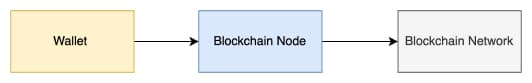

In an effort to protect your personal information, many people are turning towards Bitcoin and other forms of cryptocurrency. The concept of cryptocurrency is still relatively new to most people, which means that they may not know how to properly store their digital assets. This article will help you understand the basics of storing your coins and wallet

## What Is Cryptocurrency?

If you don't know, Cryptocurrency is digital currency that uses a decentralized network to process transactions. It's called "crypto" because it uses cryptography, which involves using complex algorithms and codes to encrypt the transaction data so that only the recipient can decrypt it with a private key. In addition, cryptocurrency is decentralized because it's not controlled by a central authority such as the government or bank. The cryptography used to encrypt and decrypt the transaction data ensures that no one can tamper with your information without you knowing about it.

---

## Wallet

A crypto wallet is a device or application that stores a collection of keys and can be used to send, receive, and track ownership of cryptocurrencies. Wallets can take many forms. A wallet might be a directory or file in your computer's file system, a piece of paper, or a specialized device called a hardware wallet. There are also various smartphone apps and computer programs that provide a user-friendly way to create and manage wallets.

## Type of wallet

Asymetric crypto algoritm have key pair with the public key and public key. these are different method to store it.

### Hardware wallets

A hardware wallet is a physical device, about the size of a thumb drive, that stores the private keys to your crypto offline. Most people don’t use hardware wallets because of their increased complexity and cost, but they do have some benefits — for example, they can keep your crypto secure even if your computer is hacked. However, this advanced security makes them inconvenient to use compared to a software wallet and they can cost upwards of $100 to buy example [ledger](https://www.ledger.com/)

### Paper Wallet

A paper wallet is a piece of paper with your private and public keys printed out. Some paper wallets might also have a scannable barcode created by an app. It is a way to store and take access to your cryptocurrency offline. When you print your keys, they are removed from the cryptocurrency network, but the tokens remain; however, they are inaccessible without your keys.

Paper wallets were generally used before cryptocurrency became popular. Storage technology has improved since the method was popular, but it remains a valid way to store your keys in certain circumstances.

You might encounter a time when you need to store your cryptocurrency on paper; therefore, it's essential to understand what a paper wallet is, how it works, and the risks if your circumstances require you to create one. [source](https://www.investopedia.com/terms/p/paper-wallet.asp)

### CLI/Fs Wallet

A file system wallet is the most convenient and least secure form of wallet. It is convenient because the keypair is stored in a simple file. You can generate as many keys as you would like and trivially back them up by copying the files. It is insecure because the keypair files are unencrypted. If you are the only user of your computer and you are confident it is free of malware, an FS wallet is a fine solution for small amounts of cryptocurrency. If, however, your computer contains malware and is connected to the Internet, that malware may upload your keys and use them to take your tokens. Likewise, because the keypairs are stored on your computer as files, a skilled hacker with physical access to your computer may be able to access it. Using an encrypted hard drive, such as FileVault on MacOS, minimizes that risk.

### App/Web/Browser Extention - UI Wallet

A third party keeps your crypto for you with interface like web/app or any Interface, similar to how a bank keeps your money in a checking or savings account. You may have heard of people “losing their keys” or “losing their USB wallet” but with a hosted wallet you don’t have to worry about any of that.

---

## Wallet Store Dependency

There are many different types of crypto wallet dependencies, but the most popular ones are hosted wallets, and non-custodial wallets.

### Hosted wallets

The most popular and easy-to-set-up crypto wallet is a hosted wallet. When you buy crypto using an app, your crypto is automatically held in a hosted wallet. It’s called hosted because a third party keeps your crypto for you, similar to how a bank keeps your money in a checking or savings account. You may have heard of people “losing their keys” or “losing their USB wallet” but with a hosted wallet you don’t have to worry about any of that.

The main benefit of keeping your crypto in a hosted wallet is if you forget your password, you won’t lose your crypto. A drawback to a hosted wallet is you can’t access everything crypto has to offer. However, that may change as hosted wallets start to support more features

### Self-custody wallets

A self-custody wallet, puts you in complete control of your crypto. Non-custodial wallets don’t rely on a third party — or a “custodian” — to keep your crypto safe. While they provide the software necessary to store your crypto, the responsibility of remembering and safeguarding your password falls entirely on you. If you lose or forget your password — often referred to as a “private key” or “seed phrase” — there’s no way to access your crypto. And if someone else discovers your private key, they’ll get full access to your assets.

Why have a non-custodial wallet? In addition to being in full control of the security of your crypto, you can also access more advanced crypto activities like yield farming, staking, lending, borrowing, and more. But if all you want to do is buy, sell, send, and receive crypto, a hosted wallet is the easiest solution.

---

## How to make own hosted wallet with UI

Author want to make crypto wallet for subscription using crypto. so you can make auto payment every month from your asset. the plan are to make hosted wallet in friendly UI Interface and it called HBSWallet. its based on SOLANA network cause it's fast.

To interact with blockchain network there are API to make keypair, to transfer, check keypair assets. here some example of API that you can use in solana network, [DOCUMENTATION]( https://docs.solana.com/developing/clients/jsonrpc-api)

Great, you can interact with solana network directly, but there are rate limit in solana network for public used Maximum number of requests per 10 seconds per IP: 100, it slow for hosted, in other to break rate limit we have to own/rent a blockhain node.

So now we have blockhain node in middle. The wallet are programmed so app can subscription model are on our server, with that you can have a subscription wallet in crypto.

## Conclusion

Wallet are stored your public and private key, and can be to send, receive, and track ownership of cryptocurrencies. Keep it safe, and if you builder and want to make own wallet. go ahead its not that complicated
