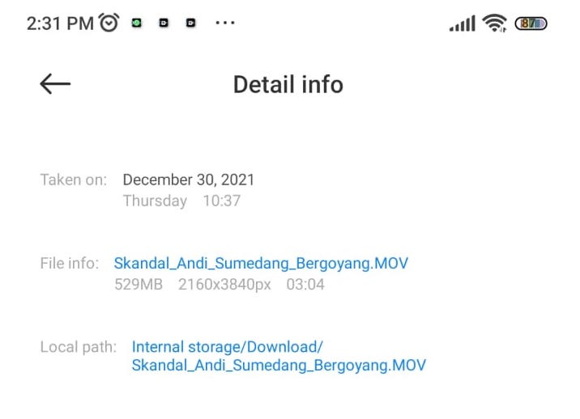
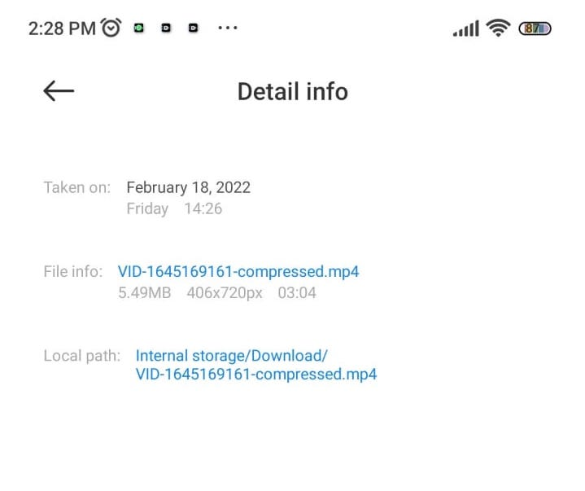
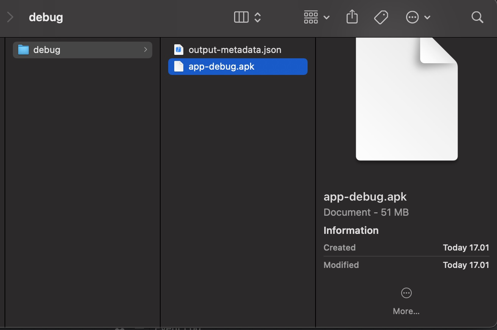
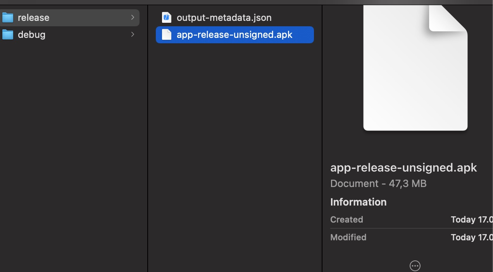
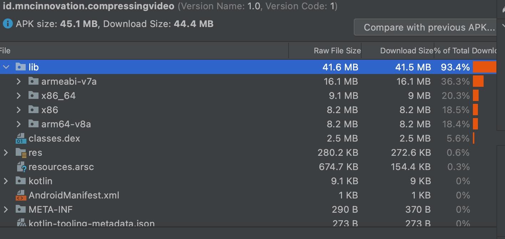

### Introduction
Today we often meet the media especially on social media (tiktok, instagram, facebook) that have upload and editor video feature. As developers who want to develop video editor, we need to know how to format and edit the video. One of familiar framework that can do that is FFmpeg.

FFmpeg is an multimedia framework to record, convert and stream video and audio files, it supports nearly every digital format and codec known, it’s available on most operating systems and platforms it is a powerful command-line tool written in C and Assembly by Fabrice Bellard.

### Command
We can use command line to do various audio, video transcoding and conversion operations.

We are now going to see some important and useful FFmpeg commands.

#### 1. Getting audio/video file information
To display the details of a media file, run:<br/>

```$ ffmpeg -i video.mp4```
Sample output:
```
ffmpeg version n4.1.3 Copyright (c) 2000-2019 the FFmpeg developers
built with gcc 8.2.1 (GCC) 20181127
configuration: --prefix=/usr --disable-debug --disable-static --disable-stripping --enable-fontconfig --enable-gmp --enable-gnutls --enable-gpl --enable-ladspa --enable-libaom --enable-libass --enable-libbluray --enable-libdrm --enable-libfreetype --enable-libfribidi --enable-libgsm --enable-libiec61883 --enable-libjack --enable-libmodplug --enable-libmp3lame --enable-libopencore_amrnb --enable-libopencore_amrwb --enable-libopenjpeg --enable-libopus --enable-libpulse --enable-libsoxr --enable-libspeex --enable-libssh --enable-libtheora --enable-libv4l2 --enable-libvidstab --enable-libvorbis --enable-libvpx --enable-libwebp --enable-libx264 --enable-libx265 --enable-libxcb --enable-libxml2 --enable-libxvid --enable-nvdec --enable-nvenc --enable-omx --enable-shared --enable-version3
libavutil 56. 22.100 / 56. 22.100
libavcodec 58. 35.100 / 58. 35.100
libavformat 58. 20.100 / 58. 20.100
libavdevice 58. 5.100 / 58. 5.100
libavfilter 7. 40.101 / 7. 40.101
libswscale 5. 3.100 / 5. 3.100
libswresample 3. 3.100 / 3. 3.100
libpostproc 55. 3.100 / 55. 3.100
Input #0, mov,mp4,m4a,3gp,3g2,mj2, from 'video.mp4':
Metadata:
major_brand : isom
minor_version : 512
compatible_brands: isomiso2avc1mp41
encoder : Lavf58.20.100
Duration: 00:00:28.79, start: 0.000000, bitrate: 454 kb/s
Stream #0:0(und): Video: h264 (High) (avc1 / 0x31637661), yuv420p(tv, smpte170m/bt470bg/smpte170m), 1920x1080 [SAR 1:1 DAR 16:9], 318 kb/s, 30 fps, 30 tbr, 15360 tbn, 60 tbc (default)
Metadata:
handler_name : ISO Media file produced by Google Inc. Created on: 04/08/2019.
Stream #0:1(eng): Audio: aac (LC) (mp4a / 0x6134706D), 44100 Hz, stereo, fltp, 128 kb/s (default)
Metadata:
handler_name : ISO Media file produced by Google Inc. Created on: 04/08/2019.
At least one output file must be specified
```

#### 2. Converting video files to audio files
To convert a video file to audio file, just specify the output format as .mp3, or .ogg, or any other audio formats.

The above command will convert input.mp4 video file to output.mp3 audio file.<br/>
```$ ffmpeg -i input.mp4 -vn output.mp3```

Also, you can use various audio transcoding options to the output file as shown below.<br/>
```$ ffmpeg -i input.mp4 -vn -ar 44100 -ac 2 -ab 320k -f mp3 output.mp3```<br/>

Here,
- -vn - Indicates that we have disabled video recording in the output file.
- -ar - Set the audio frequency of the output file. The common values used are  22050, 44100, 48000 Hz.
- -ac - Set the number of audio channels.
- -ab - Indicates the audio bitrate.
- -f - Output file format. In our case, it's mp3 format.


#### 3. Converting video files to different formats
Since FFmpeg is a feature-rich and powerful audio and video converter, so It's possible to convert media files between different formats. Say for example, to convert mp4 file to avi file, run:<br/>
```$ ffmpeg -i video.mp4 video.avi```

Similarly, you can convert media files to any format of your choice.

For example, to convert youtube flv format videos to mpeg format, run:<br/>
```$ ffmpeg -i video.flv video.mpeg```<br/>
If you want to preserve the quality of your source video file, use '-qscale 0' parameter:<br/>
```$ ffmpeg -i input.webm -qscale 0 output.mp4```<br/>
To check list of supported formats by FFmpeg, run:<br/>
```$ ffmpeg -formats```

#### 4. Format video files
In addition to convert to different formats, we can also add some property like scale=width:height (to change scale of video). Example:
* Scale
```$ ffmpeg -i video.flv -vf scale=-1,720 video.mpeg```
```$ ffmpeg -i video.flv -vf scale=-1,720 video.flv```

``-vf`` is pre-command for video format.
The above command will scaling the video by heigth to 720 and the width will follow.
* crf (Constant Rate Factor)
The crf flag ensures a variable bitrate for constant quality.
As others have pointed out, the values will depend on which encoder you're using.
    - For [x264](https://trac.ffmpeg.org/wiki/x264EncodingGuide) your valid range is 0-51:<br/>
        The range of the quantizer scale is 0-51: where 0 is lossless, 23 is default, and 51 is worst possible. A lower value is a higher quality and a subjectively sane range is 18-28. Consider 18 to be visually lossless or nearly so: it should look the same or nearly the same as the input but it isn't technically lossless.

    - For [vpx](https://trac.ffmpeg.org/wiki/vpxEncodingGuide) the range is 4-63 <br/>
        By default the CRF value can be from 4–63, and 10 is a good starting point. Lower values mean better quality.

    >**In both cases, a lower value means higher quality**. In our experience, we see x264 much more often.


### Case Video Compression
Last month we do some research about compressing video file for Miss Indonesia registration in our native iGetSpot app.
In case we have to upload large video from mobile device which have 4k resolution of camera (3 minutes duration can reach up to 500MB) and the requirement said "maximum for video size that allowed to upload is 3 minutes of duration with size 20MB", what should we do?
Of course we need to compress it. The next question is how?

#### Compressing Video File Using FFmpeg
We decide to compress the video using FFmpeg. We found the library of FFmpeg on github ([FFmpeg-Kit](https://github.com/tanersener/ffmpeg-kit)). Available for native Android, native iOS and also flutter.
As we know, FFmpeg has many features and make library size very large. But with FFmpeg-Kit we can choice library only on package that we need only. So, for video format and compression video we only need library with package name ``min-gpl`` which have external libraries below.
External Libraries
-- |
vid.stab |
x264 |
x265 |
xvidcore |

We also use LTS version to support Android API Level from 16. For more info you can visit [FFmpeg-Kit LTS Release](https://github.com/tanersener/ffmpeg-kit#10-lts-releases)

Next implement the code.

> We use this [video sample](https://drive.google.com/file/d/1NSpIt3IUqS1fgmocNLHXtTkpmXuk7zbW/view) (505MB 2160x3840px) to test.

1. First we scale the video by using height 720.</br>
    ```-i video.mp4 -vf scale=-1,720 video.mp4```</br>
    The result is from 500MB, compressed to 8.18MB and compressing time is about 12 minutes.

2. Completing the process with preset.</br>
    A preset is a collection of options that will provide a certain encoding speed to compression ratio.</br>
    ```-i video.mp4 -vf scale=-1,720 -preset veryfast video.mp4```</br>
    The result is same compressed to 8.18MB but process time is about 10 minutes.
3. Next we need to set the bitrate of video.</br>
    ```-i video.mp4 -vf scale=-1,720 -preset veryfast -crf 25 video.mp4```
    The result is compressed to **5.49MB** 406x720px with more good quality of video then before. For the time of process is about 12 minutes.</br>

Video sample information</br>

Compressed Video information


4. Create the native SDK.</br>
    After trial and error, and get the best value for our video compression format. The next step is create native SDK.
    We provide variable to set of scale, preset and bitrate to user for customize it as user needs.

To see sample code of integration or tutorial to use our SDK you can visit:
* [InnoVideoConverterAndroid](https://github.com/mncinnovation/inno-video-converter-android) for Android
* [InnoVideoConverteriOS](https://github.com/mncinnovation/inno-video-converter-ios) for iOS

### Conclusion
By using FFmpeg besides to edit media file, we can also compress the video with large file size.
FFmpeg always using convertion method from input file to output file. So we created the SDK with name InnoVideoConverter.

#### Pros of using FFmpeg
- It is also highly portable.
- It is profoundly valuable for the transcoding of all kinds of multimedia files into a single common format.
- You don’t need heavy Third-party VideoEditors like Adobe Premiere Pro, Filmora for small editing tasks.

#### Cons of using FFmpeg
- It’s difficult for beginners to use and implement.
- It takes some time to process. We don’t get results in a second or two. It based on the input video (media file) size and also processor and RAM. The larger size video, or lower processor then more time to process needed.
- The official documentation is quite confusing and it’s not beginner-friendly.
- APK size becomes large although we use ``min-gpl`` package of FFmpeg-Kit. </br>

app-debug size apk 51MB</br>

app-release-unsigned apk 47,3MB

total lib size 41,6MB</br>
The FFmpeg libraries alone will use 30-70MB depending upon the libraries you are including. For ``min-gpl`` will use about 40MB