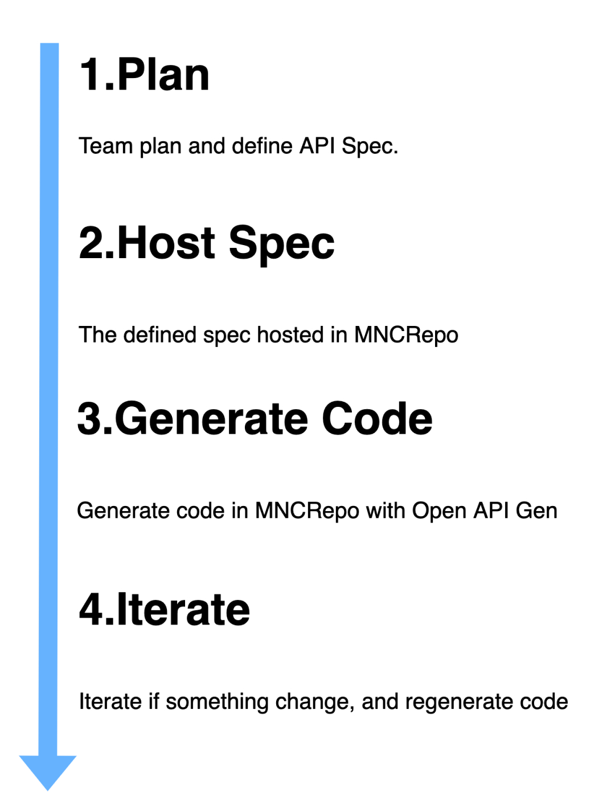

So open api are good and you want to generate your workflow. You want to generate an open api spec so you can use it with workflow, and then integrate that into your codebase. So let's look at the process of doing that.

Here some workflow to implement api

## Planning

To generate an Open API Spec, you will need to get a list of your services, component, and other Open API Spec component.

Who can make planning?
The main dev who make planing are backend developer, cause they who has data and control over it. And other developer can join planing if they experienced enough to understand.

What are the goals of planning?
Every planing have its goal, and the main goal of this planning is to make Open API Spec, this what you need to take into consideration when making a planing, at least this some goal you can take consider: 

- What service do we need?
- What kind of data do we have?
- What is the structure of data?
What kind of service does each component need?

## Host Spec

You planned open api spec, and host it in MNC Repo. You also need to plan how you want your open api spec to be hosted.

## Generate Code

To generate in MNCRepo CI/CD system, you will need to write a script. 

The main purpose of this script is to generate open api spec and host it in MNC Repo. But the second purpose is to make CI/CD system so that you can depend this open api spec in your codebase. to find out example and script go to [this page](https://mnc-repo.mncdigital.com/h/codegen-mobile-perindo).

## Iterate

Business changes, Requirement change, Things are not as planed, so you need to reevaluate and make changes in your open api spec. repeat from the plane phase.

## Conclusion

I hope that I can help some of you who want to make a good and fast open api spec. If you have any question or feedback about my blog post, please leave a message below or contact me at my email address: handi.deyana@mncgroup.com

Good luck
