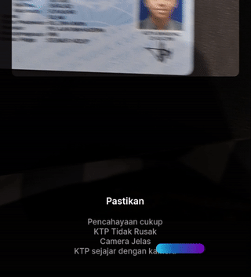



OJK(Indonesia regulator) state that financial service must identify their  customer to prevent money laundry and terrorism.

    MNC Identifier is a service to identify,
    and verify consumer with AI in it.

## Features

### OCR

AI algorithm to perform Optical Character Recognition (OCR) to extract KTP NIK (Indonesian Citizen Number)

### Face detection

AI algorithm to detect face

### Face distance validation

Ensure user not too far and too close from front camera

### Closed Eye validation

Ensure user face straight to front camera

### Face straight validation

Ensure user face straight to front camera

### Selfie with KTP validation

Ensure user hold KTP when selfie using machine learning algorithm  

### Face smiling validation

To minimize bias when validating face and photo in KTP, identifier prevent user smiling.

### In device machine learning

Every features are used in device machine learning, so it can work offline, without internet.

In this first preview we implemented client side in device ML to make validation.

### Download

    Try it now 

[Download APK](https://bit.ly/3afCav0)

Privacy? No data collected yet, you can turn off the connection if you want to.
