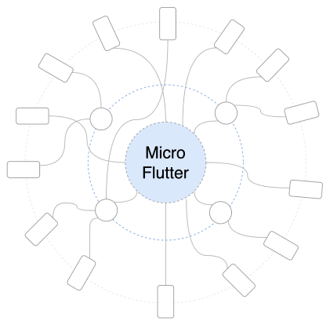
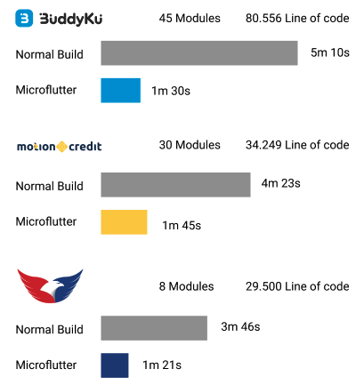

After successfully making standard with [great adoption](https://mobile.mncinnovation.id/blog/code-standard-how-mnc-mobile-innocent-solved-unmaintainable-code/) and there are several feedback from flutter developer across MNC, one of those is build time in large project.

In large project it will build from 5-30 min to build entire app.

To solve build time problem in development phase, we came up with new standard called **microflutter**

## What is Microflutter

micro flutter is microservice approach to a flutter project, instead one big flutter project. a project splitted into different flutter project. microflutter are inspired by microservice  framework that already exist.

---

## Advantage of micro flutter

- Faster development time
- Domain focus development

### How Fast

The advantage is that you don't need to rebuild the entire application when making changes to the lib. We did benchmarks in several mnc apps

- *The benchmark are taken in macbook pro*
- *Module used in microflutter are login module around 900 Line of code*

Line of code are caculated base on .dart file

### Align with microservice team

In a large organization team there are team who in charge in one feature. microflutter are able to connect with this kind of team

---

## When NOT to use micro flutter

Microflutter are great, but it add complexity to system and code. your team should not use microflutter when

### You team are still new to flutter

There things that new or junior developer can't understand the microflutter something like dependency injection, service mock, etc. if your developer can't understand the code, it's rewrite to something they will understand.

### You team have less 3 persons

Since it add complexity its better to use microflutter within large and experienced team in flutter. when the developer are less than 3 persons, probability to switch context and rebuild app are bigger. so instead making faster, it make workflow slower.

## Is it different from current standard

No, microflutter split project with diffrent flutter project, inside the flutter project you have to use current mnc flutter standard.

---

## Conclusion

With microflutter you can develop a project faster. since you not compile entire app. but compile a lib flutter app.