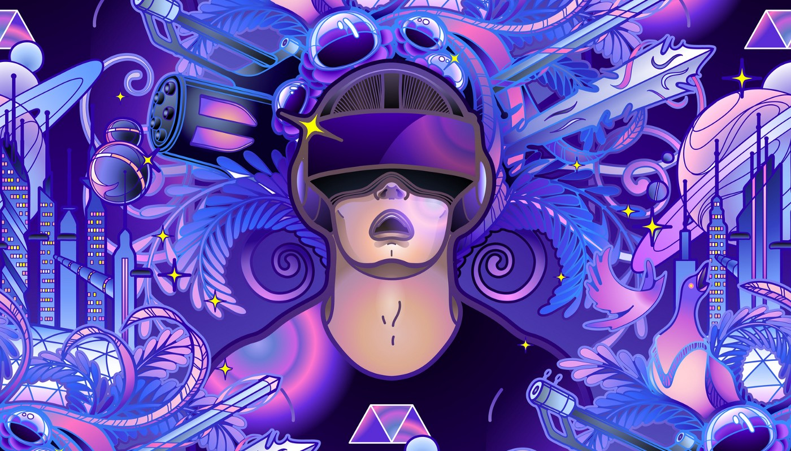

Since the popularisation of the Internet in 1990s, the cyberspace has kept evolving. We have created various computer-mediated virtual environments including social networks, video conferencing, virtual 3D worlds (e.g., [VR Chat](https://hello.vrchat.com)), augmented reality applications (e.g.,[ Pokemon Go](https://pokemongolive.com/en/)), and Non-Fungible Token Games (e.g., [Upland](https://www.upland.me)). Such virtual environments, albeit non-perpetual and unconnected, have bought us various degrees of digital transformation. At the core of the metaverse stands the vision of an immersive Internet as gigantic, unified, persistent, and shared realm.While the metaverse may seems futuristic, catalysed by emerging technologies such as Extended Reality, 5G, Artificial Intelligence, the digital “big bang” of our cyberspace is not far away.

Metaverse, combination of the prefix “meta” (implying transcending) with the word “universe”, describes a hypothetical synthetic environment linked to the physical world. The word ‘metaverse’ was first coined in a piece of speculative fiction named *Snow Crash, *written by *Neal Stephenson *in 1992. In this novel Stephenson defines the metaverse as a massive virtual environment parallel to the physical world, in which users interact through a digital avatars. According to the [*Milgram and Kishino’s Reality-Virtuality Continuum](https://www.researchgate.net/figure/Milgram-and-Kishinos-Mixed-Reality-on-the-Reality-Virtuality-Continuum-Milgram-and_fig1_321405854)*, XR integrates digital and physical to various degrees, e.g., augmented reality (AR), mixed reality (MR), and virtual reality (VR). Similarly, the metaverse scene in *Snow Crash *projects the duality of the real world and a copy of digital environments. In the metaverse, all individual users own their respective avatars, in analogy to the user’s physical self, to experience an alternate life in a virtuality that is a metaphor of the user’s real worlds.

*Fig. 1. Three stages of development*

To achieve such duality, the development of metaverse has to go through three sequential stages, namely digital twins, digital natives and co-existence of physical-virtual reality or the surreality. Digital twins refer to large-scale and high fidelity digital models and entities duplicated in virtual environments. *Digital twins *reflect the properties of their physical counterparts, including the object motions, temperature, and even function. The connection between the virtual and physical twins is tied by their data. After establishing a digital copy of the physical reality, the second stage focuses on *native content creation*. Content creators, perhaps represented by the avatars, involve in digital creations inside the digital worlds. Such digital creations can be linked to their physical counterparts, or even only exist in the digital world. Meanwhile, connected ecosystems, including culture, economy, laws, and regulations (e.g, data ownership), social norms, can support these digital creation. Such ecosystems are analogous to real-world society’s existing norms and regulations, supporting the production of physical goods and intangible contents. In the third and final stage, the metaverse could become a self-sustaining and persistent virtual world that *co-exists and interoperates *with the physical world with a high level of independence. As such, the avatars, representing human users in the physical world, can experience heterogeneous activities in real-time charac- terised by unlimited numbers of concurrent users theoretically in multiple virtual worlds. Remarkably, the metaverse can afford interoperability between platforms representing different virtual worlds, i.e., enabling users to create contents and widely distribute the contents across virtual worlds. For instance, a user can create contents in a game, e.g., [*Minecraft](https://www.minecraft.net/en-us)*, and transfer such contents into another platform or game, e.g.,[ *Roblox](https://www.roblox.com)*, with a continued identity and experience. To a further extent, the platform can connect and interact with our physical world through various channels, user’s information access through head-mounted wearable displays or mobile headsets (e.g. Microsoft Hololens), contents, avatars, computer agents in the metaverse interacting with smart devices and robots, to name but a few.

*Fig. 2. The cyberspace landscape of real-life applications, where superseding relationships exists in the information richness theory (left-to-right) as well as transience-permanence dimension (bottom-to-top).*

According to the diversified concepts of computer-mediated universe mentioned above, one may argue that we are already situated in the metaverse. Nonetheless, this is only partially correct, and we examine several examples to jus- tify our statement with the consideration of the three-stage metaverse development roadmap. [The *Earth 3D map](https://earth3dmap.com)* offers picture frames of the real-world but lacks physical properties other than GPS information, while social networks allow users to create contents but limited to texts, photos, and videos with limited options of user engagements (e.g., liking a post). Video games are getting more and more realistic and impres- sive. Users can experience outstanding graphics with in-game physics, e.g., *Call of Duty: Black Ops Cold War*, that deliver a sense of realism that resembles the real world in great details. A remarkable example of an 18-year-old virtual world, [*Second Life](http://secondlife.com)*, is regarded as the largest user-created 3D Universe. Users can build and shape their 3D environments and live in such a virtual world extravagantly. However,video games still lack interoperability between each other. The emerging platforms leveraging virtual environments (e.g., VRChat and Microsoft Mesh) offer enriched environments that emulate virtual spaces for social gatherings and online meetings. How- ever, these virtual spaces are not perpetual, and vanish after the gatherings and meetings. Virtual objects in AR games (e.g., Pokemon Go) have also been attached to the physical reality without reflecting any principles of the digital twins.

Figure **2** further demonstrates the significant gap that re- mains between the current cyberspace and the metaverse. Both x- and y-axes demonstrate superseding relationships: Left-to-Right (e.g., Text < Image) and Bottom-to-Top (e.g., Read and Write (RW) < Personalisation). The x-axis depicts various media in order of information richness from text, image, audio, video, gaming, virtual 3D worlds, virtu- ality (AR/MR/VR, following *Milgram and Kishino’s Reality- Virtuality Continuum*) and eventually, the physical world. The y-axis indicates user experience under a spectrum be- tween transience (Read and Write, RW) and permanence (Experience-Duality, ED). We highlight several examples to show this superseding relationship in the y-axis. At the *Read & Write *level, the user experience does not evolve with the user. Every time a user sends a SMS or has a call on Zoom, their experience is similar to their previous experiences, as well as these of all the other users. With *personalisation*, users can leverage their preference to explore cyberspaces like Spotify and Netflix. Moving upward to the next level, users can proactively participate in *content creation*, e.g., Super Mario Marker allows gamers to create their tailor-made game level(s). Once a significant amount of user interaction records remain in the cyberspace, under the contexts of personalisation and content creation, the cyberspace evolves to a social community.

However, to the best of our knowledge, we rarely find real-life applications reaching top levels of experience-duality that involves shared, open, and perpetual virtal world. In brief, the experience-duality emphasises the perpetual virtual worlds that are paired up with the long-lasting physical environments.

To realise the metaverse, technologies other than the Internet, social networks, gaming, and virtual environments, should be taken into considerations. The advent of AR and VR, high-speed networks and edge computing, artificial intelligent, and blockchain, serve as the building blocks of the metaverse.

*Fig. 3. Connecting the physical world with its digital twins, and further shifting towards the metaverse: (A) the key technologies (e.g., blockchain, computer vision, distributed network, pervasive computing, scene understanding, ubiquitous interfaces), and; (B) considerations in ecosystems, in terms of avatar, content creation, data interoperability, social acceptability, security/privacy, as well as trust/accountability.*

## METAVERSE FRAMEWORK

Due to interdisciplinary nature of the metaverse, this section aims to explain the relationship between the fourteen focused areas under two key categories, technologies and ecosystems. Under technology aspect, the eight pillars for the metaverse, human users can access the metaverse through extended reality (XR), and technique for user interactivity (e.g. manipulating virtual objects). *Computer Vision *(CV), *artificial intelligence *(AI), blockchain, robotics/ Internet of Things (IOT) can work with the user to handle various activities inside the metaverse through user interactivity and XR. Edge computing aims to improve the performance of applications that are delay-sensitive and bandwith-hungry, through managing the local data source as pre-processing data available in edge services, while cloud computing is well-recognised for its highly scalable computational power and storage capacity. Leveraging both cloud-based and edge-based service can achieve a synergy, such as maximising the application performance and hence user experiences. Accordingly, edge devices and cloud services with advanced mobile network can support the CV, AI, robots, and IoT, on top of appropriate hardware infrastructure.

The ecosystem describes an independent and meta-sized virtual world, mirroring the real world. Human users situated in the physical world can control their avatars through XR and user interaction technique for various collective activities such as content creating. Therefore, virtual economy is a spontaneous derivative of such activities in the metaverse. Analogue to the society in the physical world, content creation and virtual economy should align with the social norms and regulations. For instance, the production in the virtual economy should be protected by ownership, while such production outcomes should be accepted by other avatars (human users) in the metaverse. Also, human users would expect that their activities are not exposed to privacy risks and security threats.

In this article, i just going to explain on the technological side.

## Extended Reality(XR)

 on [Unsplash](https://unsplash.com?utm_source=medium&utm_medium=referral)](https://cdn-images-1.medium.com/max/11994/0*wH681IEKXKQKormh)*Photo by [Maxim Hopman](https://unsplash.com/@nampoh?utm_source=medium&utm_medium=referral) on [Unsplash](https://unsplash.com?utm_source=medium&utm_medium=referral)*

### — Virtual Reality (VR)

VR owns the prominent features of totally synthetic views . The commercial VR headsets provide usual way of user intercation techniques, including head tracking or tangible controllers. As such, users are situated in fully virtual environments, and interacts with virtual objects through user interaction techniques. The users with VR headsets have to pay full attention to the virtual environments, and hence separate from the physical reality. Multiple users in such virtual environments can collaborate with each other in real-time. This aligns with the well-defined requirements of virtual environments: a shared sense of space, a shared sense of presence, a shared sense of time (real-time interaction), a way to communicate (by gesture, text, voice, etc) and a way to manipulate objects. In other words, how the users should perceive the virtual objects and the multi-user collaboration in virtual shared space would become the critical factors. However, managing and synchronising the dynamic states / events at scale is a huge challenge, especially when we consider unlimited concurrent users collectively act on virtual objects and interact with each other without sensible latency, where latency could negatively impact the user experiences.

 on [Unsplash](https://unsplash.com?utm_source=medium&utm_medium=referral)](https://cdn-images-1.medium.com/max/11124/0*2EOM5DP1K3kkdiiC)*Photo by [Patrick Schneider](https://unsplash.com/@patrick_schneider?utm_source=medium&utm_medium=referral) on [Unsplash](https://unsplash.com?utm_source=medium&utm_medium=referral)*

### — Augmented Reality (AR)

AR delivers alternated experiences to human users in their physical surroundings, which focuses on the enhancement of our physical world. In theory, computer-generated virtual contents can be presented through diversified perceptual information channels, such as audio, visuals, smell, and haptics. The first generation of AR system frameworks only consider visual enhancements, which aim to organise and display digital overlays superimposing on top of our physical surroundings. As sucj, guaranteeing seamless and lightweight user interaction with such digital entities in AR is one of the key challenges, bridging human users in the world physical with the metaverse.

Moreover, AR will situate everywhere in our living environments, for instance, annotating directions in an unfamiliar place, and pinpointing objects driven by the user contexts. As such, we can consider that the metaverse via AR, will integrate with our urban environment, and digital entities will appear in plain and palpable ways on top of numerous physical objects in urban areas. This requires significant efforts in the technologies of detection and tracking to map the virtual contents displayed with the corresponding position in the real environment.

 on [Unsplash](https://unsplash.com?utm_source=medium&utm_medium=referral)](https://cdn-images-1.medium.com/max/9096/0*rAuttkFITtuaQC5N)*Photo by [XR Expo](https://unsplash.com/@xrexpo?utm_source=medium&utm_medium=referral) on [Unsplash](https://unsplash.com?utm_source=medium&utm_medium=referral)*

### — Mixed Reality (MR)

MR is starting point of the metaverse. We consider that the metaverse begins with the digital twins that connect to the physical world. Human users subsequently start contents can be reflected in physical environments, while human users expect such digital objects to merge with our physical surroundings, we see the existing MR prototypes enclose some specific goals such as pursuing scenes of realism, bringing senses of presence, creating emphathetic physical spatial. These goals can be viewed as an alignment with the metaverse advocating that multiple virtual worlds work complementary with each other.

### USER INTERACTIVITY

 on [Unsplash](https://unsplash.com?utm_source=medium&utm_medium=referral)](https://cdn-images-1.medium.com/max/7744/0*CPtQjCbRGSOf4IuE)*Photo by [XR Expo](https://unsplash.com/@xrexpo?utm_source=medium&utm_medium=referral) on [Unsplash](https://unsplash.com?utm_source=medium&utm_medium=referral)*

### — Mobile Input Techniques

As the ultimate stage of the metaverse will interconnect both the physical world and its digital twins, all human users in the physical world can work with avatars and virtual objects situated in both the metaverse and the MR in physical environmnets. It’s necessary to enable users to interact with digital entities ubiquitously. However, the majority of the existing metaverse only allows user interactions with the keyboards and mice, which cannot accurately reflect the body movements of the avatar.

 on [Unsplash](https://unsplash.com?utm_source=medium&utm_medium=referral)](https://cdn-images-1.medium.com/max/13440/0*ji-cw_-xRioh8uU6)*Photo by [My name is Yanick](https://unsplash.com/@mynameisyanick?utm_source=medium&utm_medium=referral) on [Unsplash](https://unsplash.com?utm_source=medium&utm_medium=referral)*

### — New Human Vision via Mobile Headsets

Currently, the user immersiveness in the metaverse can be restricted by limited Field of View (FOV) on AR/MR mobile headsets. Narrowed FOVs can negatively influence the user experience, usability, and task performance. The MR/AR mobile headsets usually own FOVs smaller than 60 degrees. The limited FOV available on mobile headsets is far smaller than the typical human vision. For instance, the FOV can be equivalent to a 25-inch display 240 cm away from the user view on the low specification headsets such as Google Glass.

### — Feedback Cues

 on [Unsplash](https://unsplash.com?utm_source=medium&utm_medium=referral)](https://cdn-images-1.medium.com/max/10368/0*DSKGlJHAF8mbZPs4)*Photo by [John Schnobrich](https://unsplash.com/@johnschno?utm_source=medium&utm_medium=referral) on [Unsplash](https://unsplash.com?utm_source=medium&utm_medium=referral)*

After considering the input and output techniques, the user feedback cues is another important dimension for user interactivity with the metaverse. The example is user interaction with virtual buttons. Virtual environments can provide highly adaptive yet realistic environments, but the usability and the sense of realism are subject to the proper design of user feedback cues. The key difference between touch screen devices and virtual environments is that touch screen devices offer haptic feedback cues when user taps on a touch screen, thus improving user responsiveness and task performances. In contrast, the lack of haptic feedback in virtual environments can be compensated multiple simulated approaches, such as virtual spring, redirected tool mediated manipulation, stiffness, object weighting.

## INTERNET of THINGS(IoT) and ROBOTICS

 on [Unsplash](https://unsplash.com?utm_source=medium&utm_medium=referral)](https://cdn-images-1.medium.com/max/12000/0*awEVl8SybKdgSRXX)*Photo by [Vinicius "amnx" Amano](https://unsplash.com/@viniciusamano?utm_source=medium&utm_medium=referral) on [Unsplash](https://unsplash.com?utm_source=medium&utm_medium=referral)*

### — *VR/AR/MR-driven human-IoT interaction*

The accelerating availability of smart IoT devices in our everyday environments offers opportunities for novel services and applications that can improve our quality of life. However, miniature-sized IoT devices usually cannot accommodate tangible interfaces for proper user interaction. The digital entities under the spectrum of XR can compensate for the missing interaction components. In particular, users with see-through displayas can view XR in mid-air. Additionally, some bulky devices like robot arms, due to limitations of form factors, would prefer users to control the devices remotely, in which XR serves as an on-demand controller.

### — Connected Vehicles

As nowadays vehicles are equipped with powerful computational capacity and advanced sensors, connected vehicles with 5G or even more advanced networkds could go beyond the vehicle-to-vehicle connections, and eventually connect with the metaverse. Considering vehicles are semi public spaces with high mobility, drivers and passangers inside vehicles can receive enriched media. With the above incentive, the community and industry are striving to advance the progress of autonomous driving technologies in the era of AI. Connected vehicle serves as an example of IoT devices as autonomous vehicles could become the most popular scenarios for our daily commute. AR/MR play an important role in empowering the innovation of autonomous driving. Tp date, AR/MR has been applied in three direction for autonomous driving. First of all, AR/MR helps the public understand how autonomous vehicles work on the road, by offering visual cues such as the vehicle directions. With such understandings, pedestrian safety has been enhanced. To this end, several industrial applications, such as Civil Maps 16, applied AR/MR to provide a guide for people to understand how an autnomous driving vehicle navigates in the outdoor environment. For instance, it show how the vehicle detects the surroundings, vehicle, traffic lights, pedestrians, and so on. In addition, some AR-supported dynamic maps can also help drivers to make good decisions when driving on the road. Second, AR/MR help to improve road safety. For instances, virtual entities appear in front of the windshiled of vehicles, and such entities can augment the information in the physical world to enhance the user awareness to the road conditions.

 on [Unsplash](https://unsplash.com?utm_source=medium&utm_medium=referral)](https://cdn-images-1.medium.com/max/10000/0*u2S-pPgV4iyiRc8Q)*Photo by [Lenin Estrada](https://unsplash.com/@lenin33?utm_source=medium&utm_medium=referral) on [Unsplash](https://unsplash.com?utm_source=medium&utm_medium=referral)*

### — Robots with Virtual Environment

Virtual environments such as AR/VR/MR are good solution candidates for opening the communication channels between robots and virtual environments, due to their prominent feature of visualising contents. Furthermore, various industrila examples integrate of virtual environments to enable human users to understand robot operations, such as task scenario analysis and safety analysis. Therefore, human users build trust and confidence with the robots, leading to the paradigm shift towards human-robot collaboration.

## ARTIFICIAL INTELLIGENCE

 on [Unsplash](https://unsplash.com?utm_source=medium&utm_medium=referral)](https://cdn-images-1.medium.com/max/10108/0*JrwOj3VxgHz0T3FV)*Photo by [William Daigneault](https://unsplash.com/@williamdaigneault?utm_source=medium&utm_medium=referral) on [Unsplash](https://unsplash.com?utm_source=medium&utm_medium=referral)*

### — Automatic Digital Twins

Digital twins are digital clones with high integrity and consciousness for physical entities or systems and keeps interacting with the physical world. There digital clones could be used to provide classification, recognition, prediction, and determination services for their physical entities. Human interference and manual feature selection are time-consuming. Therefore, it is necessary to automate the process of data processing, analysism and training. Deep learning can automatically extract knowledge from a large amount of sophisticated data and represent it in various kinds of applications, without manual feature engineering. Hence, deep learning has great potential to facilitate the implementation of digital twins.

*NPC in Elder Scroll: Skyrim*

### — Computer Agent

Computer agent, also known as Non-player Character (NPC), refers to the character not controlled by a player. The history for NPCs in games could be traced back to arcade games, in which the mobility patterns of enemies will be more and more complex along with the level increasing. With the increasing requirements for realism in video games, AI is applied for NPCs to mimic the intelligent behavious of players to meet players expectations on entertainment with high quality. The intelligence of NPCs is reflected in multiple aspects, including control strategy, realistic character animation, fantastic graphics, voice, etc.

 on [Unsplash](https://unsplash.com?utm_source=medium&utm_medium=referral)](https://cdn-images-1.medium.com/max/10944/0*C7Mze_BNi1eMxiwf)*Photo by [Erik Mclean](https://unsplash.com/@introspectivedsgn?utm_source=medium&utm_medium=referral) on [Unsplash](https://unsplash.com?utm_source=medium&utm_medium=referral)*

### — Autonomy of Avatar

Avatar refers to the digital representation of players in the metaverse, where players interact with the other players or the computer agents through the avatar. A player may create different avatars in different applications or games. For example, the created avatar may be like a human shape, imaginary creatures, or animals. In social communication, relevant applications that require remote presence, facial and motion characteristics reflecting the physical human are essential. Existing works in this area mainly focus on two problems: avatar creatian and avatar modeling. To create more realistic virtual environments, a wide variety of avatar representations are necessary. However, in most video games, creators only rely on several specific models or allow players to create complete avatars with only several optional submodels (nose, eyes, mouth, etc). Consequently, players avatars are highly similar.

## BLOCKCHAIN

 on [Unsplash](https://unsplash.com?utm_source=medium&utm_medium=referral)](https://cdn-images-1.medium.com/max/7680/0*WCgF2hNuYvX5ZtRN)*Photo by [Shubham Dhage](https://unsplash.com/@theshubhamdhage?utm_source=medium&utm_medium=referral) on [Unsplash](https://unsplash.com?utm_source=medium&utm_medium=referral)*

It is expected to connect everything in the world in the metaverse. Everything is digitised, including digital twins for physical entities and systems, avatars for users, large-scalse, fine-grained map on various areas, etc. Consequently, unfathomably vast amounts of data are generated. Uploading such giant data to centralised cloud servers is impossible due to the limited network resources. Meanwhile, blockchain techniques are developing rapidly. It is possible to apply blockchains to the data storage system to guarantee the decentralisation and security in the metaverse. Blockchain is a distributed database, in which data is stored in blocks instead of structured tables. The generated data by users are filled into a new block, which will be further linked onto previous blocks. All blocks are chained in chronological order. Users store blockchain data locally and synchronise them with other blockchain data stored on peer devices with a consensus model. Users are called nodes in the blockchain. Each node maintains the complete record of the data stored on the blockchain after it is chained. If there is an error on one node, millions of other nodes could reference to correct the error.

## COMPUTER VISION

 on [Unsplash](https://unsplash.com?utm_source=medium&utm_medium=referral)](https://cdn-images-1.medium.com/max/6760/0*QwPyP49RFl2HmJMR)*Photo by [Deva Darshan](https://unsplash.com/@darshan394?utm_source=medium&utm_medium=referral) on [Unsplash](https://unsplash.com?utm_source=medium&utm_medium=referral)*

### — Visual Localisation and Mapping

In the metaverse, human users and their digital representatives (avatar) will connect together and co-exist at the intersection between the physical and digital worlds. Considering the concept of digital twins and its prominent feature of interoperability, building such connections across physical and digital environments requires a deep understanding of human activities that may potentially drive the behaviours of one avatar. In the physical world, we acquire spatial information with our eyes and build a 3D reconstitution of the world in our brain, where we know the exact location of each object. Similarly, the metaverse needs to acquire the 3D structure of an unknown environment and sense its motion. To achieve this goal, simulateneous Localisation and Mapping (SLAM) is a common computer vision technique that estimates device motion and reconstructs an unknown environment. A visual SLAM algorithm has to solve several challenges simultaneously: unknown space, free-moving or uncontrollable camera, real-time and robust feature tracking. Among the diverse SLAM algorithms, have been shown to work well

 on [Unsplash](https://unsplash.com?utm_source=medium&utm_medium=referral)](https://cdn-images-1.medium.com/max/5238/0*9iO9PK81FfpDbNoa)*Photo by [Harry Quan](https://unsplash.com/@mango_quan?utm_source=medium&utm_medium=referral) on [Unsplash](https://unsplash.com?utm_source=medium&utm_medium=referral)*

### — Human Pose & Eye Tracking

We have to consider the control of avatars in 3D virtual environments. Avatar control can be achieved through human body and eye location and orientation in the physical world. Human pose tracking refers to the computer vision task of obtaining spatial information concerning human bodies in an interactive environment. In VR and AR applications, the obtained visual information concerning human

Therefore, we have to consider the control of avatars in 3D virtual environments. Avatar control can be achieved through human body and eye location and orientation in the physical world. Human pose tracking refers to the com- puter vision task of obtaining spatial information concerning human bodies in an interactive environment [310]. In VR and AR applications, the obtained visual information concerning human pose can usually be represented as joint positions or key points for each human body part. These key points reflect the characteristics of human posture, which depict the body parts, such as elbows, legs, shoulders, hands, feet, etc. [311], [312]. In the metaverse, this type of body representation is simple yet sufficient for perceiving the pose of a user’s body.

 on [Unsplash](https://unsplash.com?utm_source=medium&utm_medium=referral)](https://cdn-images-1.medium.com/max/9288/0*iOlF0Vcv8lo9WhsS)*Photo by [Ian Romie Ona](https://unsplash.com/@ianplaytheworld?utm_source=medium&utm_medium=referral) on [Unsplash](https://unsplash.com?utm_source=medium&utm_medium=referral)*

### — Holistic Scene Understanding

In the physical world, we understand the world by answering four fundamental questions: what is my role? What are the contents around me? How far am I from the referred object? What might the object be doing? In computer vision, holistic scene understanding aims to answers these questions. A person role is already clear in the metaverse as they are projected through an avatar. However, the second question in computer vision is formulated based on semantic segmentation and object detection. Regarding the third question, we estimate the distance to the reference objects based on our eyes in the physical world. This way of scene perception in computer vision is called stereo matching and depth estimation. The last question requires us to interpret the physical world based on our understanding. For instance, ‘a rabbit is eating a carrot’. We need first to recognise the rabbit and the carrot and then predict the action accordingly to interpret the scene. The metaverse requires us to interact with other objects and users in both the physical and virtual world. Therefore, holistic scene understanding plays a pivotal role in ensuring the operation of the metaverse.

 on [Unsplash](https://unsplash.com?utm_source=medium&utm_medium=referral)](https://cdn-images-1.medium.com/max/12000/0*KMZ5vViIvIjG9e_u)*Photo by [mohammad alizade](https://unsplash.com/@mohamadaz?utm_source=medium&utm_medium=referral) on [Unsplash](https://unsplash.com?utm_source=medium&utm_medium=referral)*

### — Image Restoration and Enhancement

The metaverse is connected seamlessly with the physical environments in real-time. In such a condition, an avatar needs to work with a physical person; therefore, it is important to display the 3D virtual world with less noise, blue, and high resolution in the metaverse. In adverse visual conditions, such as haze, low or high luminosity, or even rainy weather conditions, the interactive systems in the metaverse still needs to show the virtual universe.

In computer vision, these problems are studied under two aspects: image restoration and image enhancement. Image restoration aims to reconstruct a clean image from the degraded one (noisy, blur image). In contrast, image enhancement focuses on improving image quality. In the metaverse, image restoration and enhancement are much in need. For intance, the captured body information and the generated avatars may suffer from blur and noise when the user moves quickly. The system thus needs to denoise and deblur the users input signals and output clean visual information. Moreover, when the users are far from the camera, the generated avatar may be in a low resolution. It is necessary to enhance the spatial resolution and display the avatar in the 3D virtual environment with high resolution

## EDGE COMPUTING

 on [Unsplash](https://unsplash.com?utm_source=medium&utm_medium=referral)](https://cdn-images-1.medium.com/max/11696/0*CTdpjA_52gbqy7Id)*Photo by [Domenico Loia](https://unsplash.com/@domenicoloia?utm_source=medium&utm_medium=referral) on [Unsplash](https://unsplash.com?utm_source=medium&utm_medium=referral)*

### — User Experienced Latency

In the metaverse, it is essential to guarantee an immersive feeling for the user to provide the same level of experience as reality. One of the most critical factors that impact the immersive feeling is the latenct, e.g., motion to photon latency. Researchers have found that MTP latency needs to be below the human perceptible limit to allow users to interact with holographic augmentations seamlessly and directly. For instance, in the registration process of AR, large latency often results in virtual objects lagging behind the intended position, which may cause sickness and dizziness. As such, reducing latency is critical for the metaverse, especially in scenarios where real-time data processing is demanded, e.g., real-time AR interaction with physical world such as AR surgeries, or real-time user interactions in the metaverse such as multiplayer interactive exhibit in VR or multiple players battling in Fortnite.

### — Multi Access Edge Computing

The superior performance on reducing latency in virtual worlds has made edge computing an essential pillar in the metaverse creation in the eyes of many industry insiders. For example, Apple uses Mac with an attached VR headset to support 360 degree VR rendering. Facebook Oculus Quest 2 can provide VR experiences on its own without a connected PC thanks to its powerful Qualcomm Snapdragon XR2 chipset. However, its capacity is still limited compared with a powerfull PC, and thus the standalone VR experience comes at the cost of lower framerates hence less detailed VR scenes. By offloading to an edge server (e.g., PC), users can enjoy a more interactive and immersive experience at higher framerates without sacrificing detail. The Oculus Air Link announced by Facebook in April 2021 allows Quest 2 to offload to the edge at up to 1200 Mbps over the home WiFi network, enabling a lag-free VR experience with better mobility. These products, however, are constrained to indoor environments with limited user mobility.

 on [Unsplash](https://unsplash.com?utm_source=medium&utm_medium=referral)](https://cdn-images-1.medium.com/max/9184/0*4BUuo4lmlV2h3tQk)*Photo by [Towfiqu barbhuiya](https://unsplash.com/@towfiqu999999?utm_source=medium&utm_medium=referral) on [Unsplash](https://unsplash.com?utm_source=medium&utm_medium=referral)*

### — Privacy Issue

The metaverse is transforming how we socialise, learn, shop, play, travel, etc. Besides the exciting changes it’s bringing, we should be preapred for how it might go wrong. And because the metaverse will collect more than ever user data, the consequence if things go south will also be worse than eer. One of the major concerns is the privact risk. For instance, the tech giants, namely Amazon, Apple, Google, Facebook, and Microsoft, have advocated passwordless authentication for a long time, which verifies identity with a fingerprint, face recognition, or a PIN. The metaverse is likely to continue this fashion, probably with even more biometrics such as audio and iris recognition. Before, if a user lost the password, the worst case is the user lost some data and made a new one to guarantee other data safety. However, since biometrics are permanently associated with a user, once they are compromised (stolen by an imposter), they would be forever compromised and cannot be revoked, and the user would be in real trouble.

## NETWORKS

### — High Throughput and Low Latency

The metaverse will require massive amounts of bandwidth to transmit very high resolution content in real-time. Many interactive applications consider the motion-to-photon latency, that is the delay between an action by the user and its impact on-screen, as one of the primary drivers of user experience. The throughput needs of future multimedia applications are increasing exponentially. The increased capabilities of 5G(up to 10Gb/s) have opened the door to a multitude of applications relying on the real-time transmission of large amounts of data (AR/VR, cloud gaming, connected vehicles). By interconnectiong such a wide range of technologies, the metaverse bandwidth requirements will be massive, with high-resolution video flows acounting for the largest part of the traffic, followed by large amounts of data and metadata generated by pervasive sensor deployments.

### — Human- and user-centric networking

The metaverse is a user-centric application by design. As such, every component of the multiverse should palce the human user at its core. In terms of network design, such consideration can take several forms, from placing the user experience at the core of traffic management, to enabling user-centric sensing and communication.

## CONCLUSION

On a final note, technology giants such as Apple, Google, and Microsoft have ambitious plans for materialising the metaverse. With the engagement of emerging technologies and the progressive development and refinement of the ecosystem, our virtual worlds (or digital twins) will look radically different in the upcoming years. Now, our digitised future is going to be more interactive, more alive, more embodied and more multimedia, due to the existence of powerful computing devices and intelligent wearables. However, there exist still many challenges to be overcome before the metaverse become integrated into the physical world and our everyday life.
