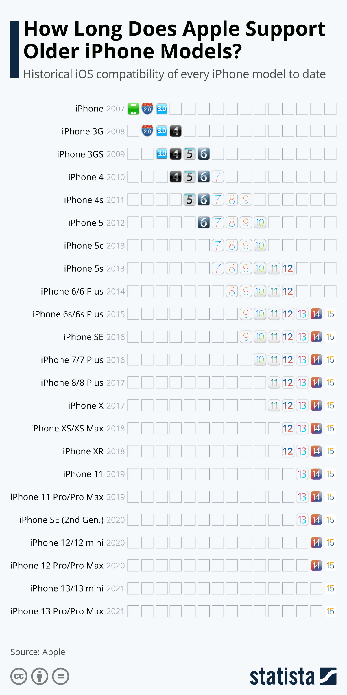
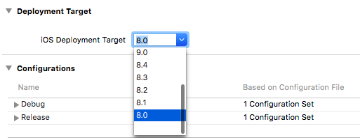
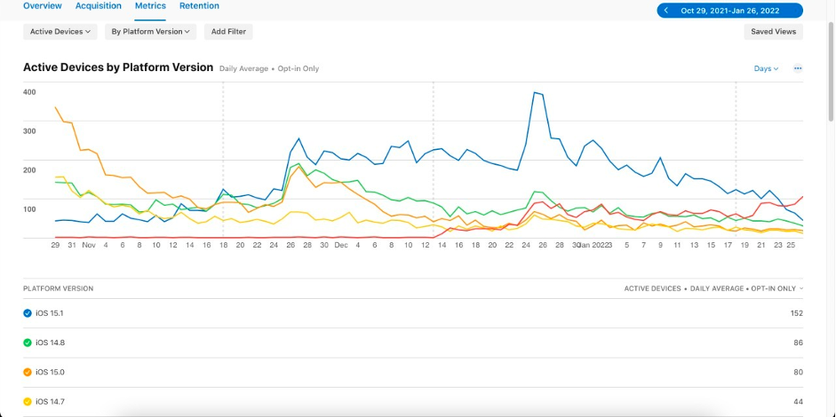
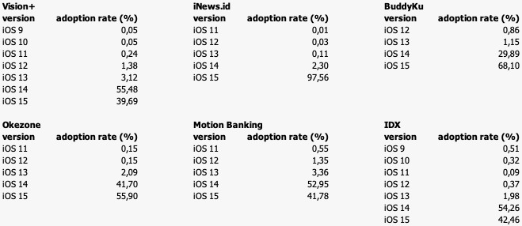
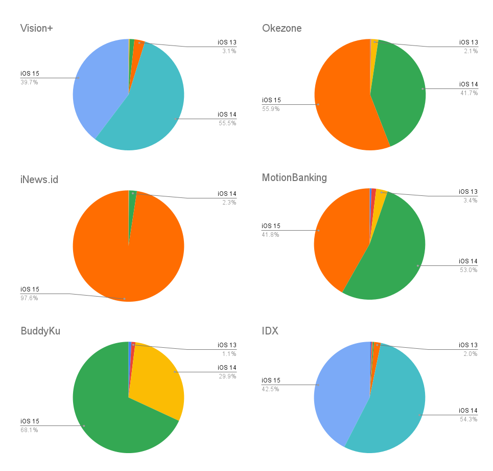

Over the past 5 years, Apple has consistently announced its latest OS versions at WWDC events. **WWDC** is Apple's annual Worldwide Developers Conference where developers can attend sessions and meet with Apple engineers. When an updated version of iOS is launched, Apple had introduced a number of new APIs, new frameworks, new UI changes and more. 
{{}}
As the following chart shows from [statista.com](https://www.statista.com/chart/5824/ios-iphone-compatibility/), Apple has done a good job over the years of keeping older devices in the loop for a long time. While the new iPhone received OS updates, later models have typically gotten software updates for five to six years.

The update oftentimes a moment to reflect on the supported OS versions and see to which minimum deployment target version your project should be set. As developer, we can discovers the [iOS adoption rate generally from App Store](https://developer.apple.com/support/app-store/) in which most of the users update to the most recent version within a year. That data may be our consideration, but we'd better look at the amount of user data that has actually uses our apps.

#### What Is a Deployment Target?

> “A deployment target is nothing more than the minimum version of the operating system the application can run on.”


[]()

#### Reasons for (not) increasing Deployment Target

Increasing an iOS version target means losing users who are on older iOS version, and losing users could mean losing revenue. Therefore, the first reason why it would not be easy is based on losing users and revenue. So, do an overview of the active users per iOS version first to find out how worthwhile it is to continue to support an older version.

---

### Do we really need a latest APIs, latest frameworks, and more?

[](https://developer.apple.com/documentation)

What's the impact on development? if you are maintaining an app that has an iOS 12 as deployment target. This means you cannot use [SwiftUI](https://developer.apple.com/xcode/swiftui/) and [Widgets](https://developer.apple.com/documentation/widgetkit/). It's technically possible and the compiler can handle it, but it's not ideal. Developer needs to protect code that should only be run on certain version with ```if #available(iOS 12, *) {}``` . SwiftUI were introduced with iOS 13 and Widgets were introduced with iOS 14, which means you need to increase your deployment target to iOS 14 if you need to use it.

### Data: Observe, Analyze, Reflect

As mentioned before, observe the data so that we will know which version our active users are using. Simply go to App Analytics page on [App Store Connect](https://appstoreconnect.apple.com/) to see the data.
{{}}

##### Let's take a look at our active users

This data collected in the period October 2021 to January 2022. We take several samples from different categories of applications to enrich the distribution of users.
{{}}

Now let's focused on oldest OS version. We're clearly know that there's some of our user still using OS version who was launched more than 6 years ago which is iOS 9. However in some applications, the oldest version that user has installed is iOS 11.

If we compare the adoption rate for each OS version, **the top 3 was iOS 13 to iOS 15** which is 80%-90% already on iOS 14 & iOS 15. 

Users of older iOS versions might be using an iPhone that only supports up to iOS 9 and iOS 11. 
Here are the latest iPhone that support:
| iOS 9 | iOS 11 |
|-------|--------|
| iPhone 4s | iPhone 5s |
|   | iPhone 6 |
|   | iPhone 6 Plus |

##### Matching needs with Requirement

Take some time to find out [what's new](https://developer.apple.com/ios/whats-new/) with each iOS version. This is useful for us to see if the update needs to be used for our application, otherwise we can ignore it. 
For example, with iOS 15 Swift 5.5 introduces concurrency support, the language with async/await and Actors. Also addition to Siri features, ARKit features or Machine Learning.

##### Understanding the Framework and Library requirement

Our app mostly using additional framework and third-party library either to saves development time and cost, or increases the quality of the app.
All of the support library packages have minimum level of OS version. We should review the reference documentation for the library classes and methods we use, and thoroughly check the version of the platform supported to the app.

---

### Conclusion

So far, maintaining deployment targets as low as possible has allowed us to serve our loyal users. But using a higher deployment target will allow our app to adopt the latest features that might make existing users more interested and new users installing our application.

Then, we must be wise matching needs of our app with requirement that OS supported. Also, we need to check support version of all the dependency/third party library that we used.


#### What Next

As measured by devices that transacted worldwide on the App Store on January 11, 2022: 63% of all devices use iOS 15, 30% use iOS 14 and 7% use earlier.
We expect iOS 16 to be unveiled in June 2022, and released to the public in September 2022.  So, in the next 1-2 years there was a high probability that devices supporting up to iOS 13 will be the most old OS version that worth to maintain.

Make sure the team are exposed with all feature that updated in each OS version. Some of interesting feature in range iOS 13 to iOS 15: SwiftUI, Dark Mode, Multi-window support, UIImagePicker, Widgets, App Clips, Picture in Picture, ARKit, and many more.