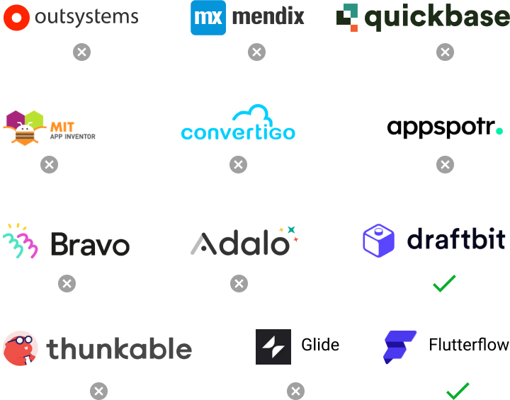
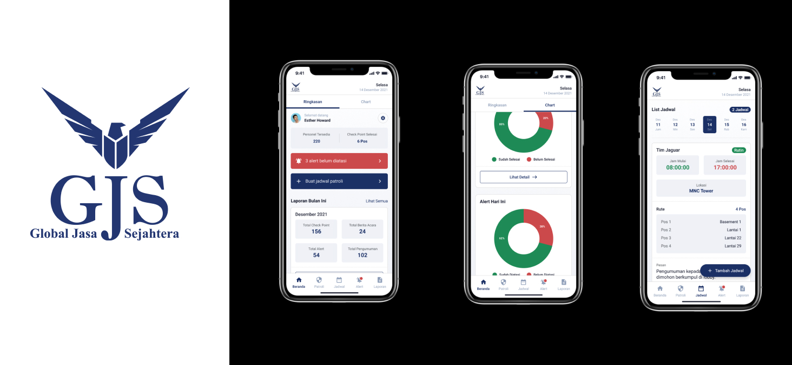
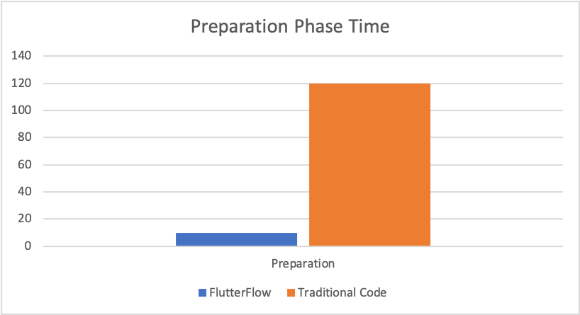
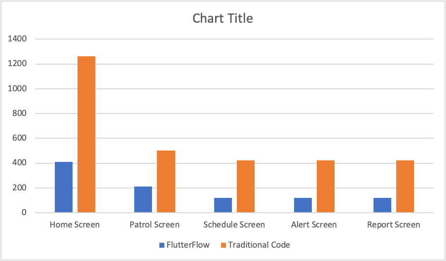
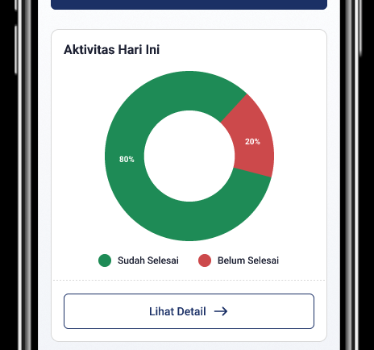

    TLDR: low code platform can used for UI Development 
    and make development faster by 3x. 
    but not all case can develop in low code.

Developer market are tight and business demand are growing, to solve this problem we tried to adopt low code technology on mobile app development hope that low code can make development faster. but is it make development faster?

## Rising of low code development

In the past we know that if we want to code, we should write the code manually. But in this era, we can code without actually writing the code. Instead of writing it manually, we can just drag & drop the code.

According to [Business Wire](https://www.businesswire.com/news/home/20180116006370/en/27.2-Billion-Global-Low-Code-Development-Platform-Market), the future of low-code or no-code with an expected growth rate of 44.4% by 2022 to $27.23 billion (up from $4.32 billion in 2017). IDC has reported that by 2023, more than 500 million apps will be developed. That is much more than decades of apps put together. In other words, the demand for digital transformation has triggered the rise of apps developed by businesses. There aren’t enough qualified developers or platforms to meet this demand. Also, there are drastic changes in the way perceive technology.

## Choosing the right low code tool

The are many low code for developing mobile app. we choose by these criteria

- Exportable
- Server integration
- Technology familiarity

### 1. Exportable

Exportable mean the code that created in platform can be exported to our codebase and use for future use case

### 2. Integration

Server Integration via Rest API, we want the tools connect to our data set.

### 3. Familiarity

Since flutter are technology in MNC innovation center are familiar with. so we choose flutter flow to develop next low code tool

## Experiment with MNC Land App

We use GJS Client App as a case study and FlutterFlow as a low-code platform. GJS Client is an apps for retrieve reports from security personnel. We choose GJS Client for this case study because of the **complexity of the app is low**.

### Preparation Phase

For the preparation phase. We have to prepare assets such as images, fonts and icons. Also, color theme, text theme, app title, package name, launcher icon, app icon. For the preparation phase in FlutterFlow it takes about 10 minutes while using traditional code takes about 120 minutes.

### Development Phase

The apps are 5 primary screen and 5 secondary screen. The total screen that we should make is about 10 screen both FlutterFlow and traditional-code. Figure 2 shows the time needed for every screen.

From that figure, we can see that in home screen, both FlutterFlow and traditional code takes more time, because when working in HomeScreen, we also build base widget for the entire screen. Compared to both, FlutterFlow takes 3x faster than traditional code.

### Advantage using flutter flow

- Simple, easy drag & drop visual builder
- Easy to learn
- Easily convert design into development code
- Frequently update more features
- Easy to integrate with external API

### Problem when development using low code today

#### Unable make custom UI

Yap we can make most of UI in GJC client but there are part when flutter flow can't solve like this chart.

to solve this problem we can export code and add the component.

#### Unable to use third party library

The third party library are useful for basic thing like add camera, maps, analytic, etc.

#### Bad writing custom function experience

You can make custom function in FlutterFlow but it is little bit difficult to do. No code completion, no code check, hard to iterate either function work or no

### Conclusion and Recommendation

Low code can make development for simple app faster by 3x and beginner friendly for new developer. but still you need to export the code for making custom ui, add functionality to make whole app.

So flutterflow can help UI development by 3x so we adopt it for UI development, since UI development are of many process to make app and we believe in technological progress maybe lowcode can make development easier in future.
