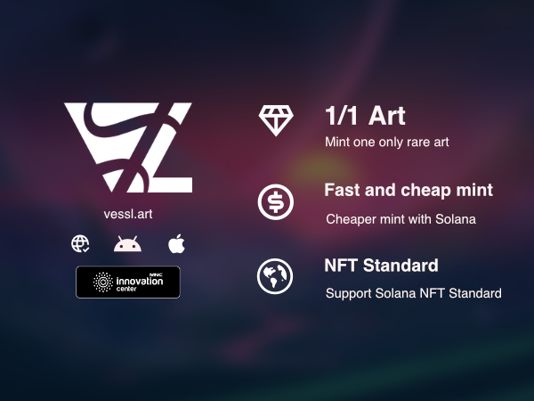

## Background

Content are strongest strength of MNC group, NFT is one of many way to distribute content. we are initiated to research about NFT to support MNC content ecosystem and MotionCrypto Ecosystem. This article is about how we make NFT marketplace, what is it, and other information you need to know in order to make NFT marketplace.

## About the project

The project are called [vessl.art](http://vessl.art) created from vessel to contain art from artist and ssl term in tech to secure data transport. its WEB, Android and IOS NFT marketplace, you can mint or create 1/1 art in blockchain so you can make one only rare art, it also provide cheaper and faster minting. it also provide standard NFT so you can mint Solana in Vessl then show in social media, sell in other marketplace. the NFT are stored in Solana blockchain.

Solana is a blockchain platform designed to host decentralized, scalable applications. Solana can process many more transactions per second and charges lower transaction fees than rival blockchains like Ethereum. Solana is a proof-of-stake (PoS) blockchain and uses a new technology called Proof of History (PoH). It also provide standard interface, program, and data structure in an ecosystem called Metaplex NFT.

## Making the marketplace

When making the marketplace there are several tech combined like frontend, backend, mobile, and blockchain. here some techstack that we used when making the marketplace:

- SvelteJS and Sveltekit for frontend web application
- Golang and Echo for main backend application
- Typescript and Fastify for making transaction interface to blockchain
- Flutter for making IOS and android App
- Bundlr for faster upload to permanent WEB
- Metaplex for Solana NFT
- Google cloud for scallable infrastructure
  We are succesfully making nft marketplace with these tech combined. you ask author if you want ask deeper can visit vessl.art to discover more.

## CONCLUSION

You can sell, buy mint nft now with solana in vessl. At first, we discover big wall when research NFT-Marketplace and stuff. with this article, i hope you can make your own Solana NFT marketplace.
