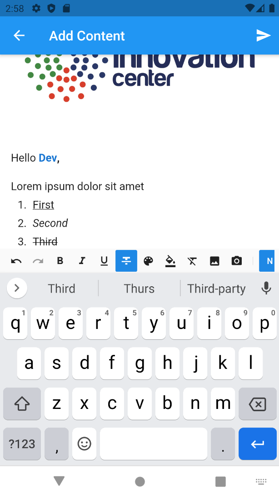
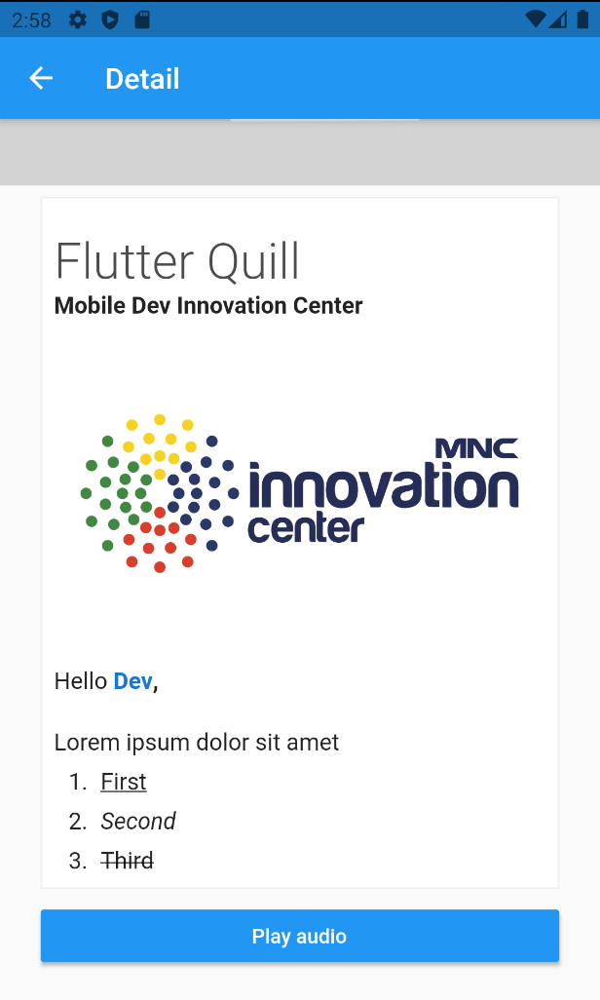

Many applications from large companies such as Google, Alibaba Group and Grab have used flutter to develop their applications. Flutter has some interesting feature, such as cross platform, fast development, and a more flexible UI. Flutter provides many beautiful widgets that can make it easier for us to make the interface more attractive.

Sometimes we want to create an application that can display content in various formats when displayed, so we need a special editor widget to create it. At this time I found a widget that can create rich text as I mentioned for flutter.



Quill is a free, open source WYSIWYG editor built for the modern web. Flutter Quill is a Quill component made especially for flutter.

### HOW TO USE IT
Run the command `flutter pub add flutter_quill` in terminal to add the package or add the `flutter_quill: ^ 1.2.0` package in pubspec.yaml file.

You can check out this [repo](https://github.com/singerdmx/flutter-quill) for advanced usage.

### DEMO
Here's an [example](https://gitlab.com/ramdannur/simple-text-editor) of a simple implementation that I built using Flutter Quill.

#### Text Editor

#### Read Content

### CONCLUSION
So far, Flutter Quill is able to create and display text in various formats such as style, alignment, paragraphs, list and others. Flutter Quill also supports uploading images (including gifs) from the gallery and camera, which we might be able to integrate with cloud storage to save files later. Flutter Quill has its own internal format, but we can create other output such as plain text or html (with some limitations).
