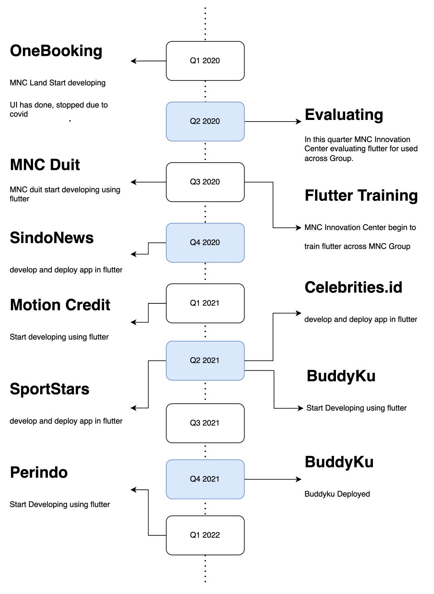

There were problems when developing mobile app, especially in MNC like **Human Resource**, **IOS**, and **Features Gap.** to solve that we at mobile MNC Innovation trying to adopt new technology called flutter

## What is Flutter

Flutter is an open source framework by Google for building beautiful, natively compiled, multi-platform applications from **a single codebase**. flutter UI use Declarative style, so developers just specifies **what is to be done** rather than how to do it. Flutter has hot reload feature helps you **quickly and easily experiment**, build UIs, add features, and fix bugs. To find out about flutter, click here

---

## Adopting new tech

In this last 2 years we tried to adapt this new technology, here the timeline

---

### Fast and developer

With fastest about 1.5 month app can be delivered and deploy. But there are two apps that develop until now, it show that development are collective work and team work. it depend on **product, team and developer**.

Number of developers when product are initiate untill first release.

Number of developers now, 1/3 mean one person in charge for 3 projects.

---

### Apps

How about the quality app? since quality are measured by many things. author pick **app engagement**, and **crash** for measureable metric.

Average engagement, data taken from Google analytic in last 30 days. 

Data taken from Google Playstore and Apple Playstore in last 30 days.

#### Feature Gap

What is feature gap, its different feature between android and ios, some feature are available in android but ios. Since flutter are multiplatform there is **0 Feature gap**. Same experience, same launch time, same developer, more productive.

---

### What next

#### Desktop development

Desktop app are tool to use for pro to solve theire problem like trading app, music editor app etc. we will continue to use flutter and explore desktop evironment since flutter desktop evironment now production ready.



#### Low code

Currently we are experimenting with low code in mobile development, stay tune for next update

Thats it, if you want learn flutter please feel free to contact us at [Mendhy - MNC Innvoation Mobile lead](mailto:mendhy.galuh@mncgroup.com)