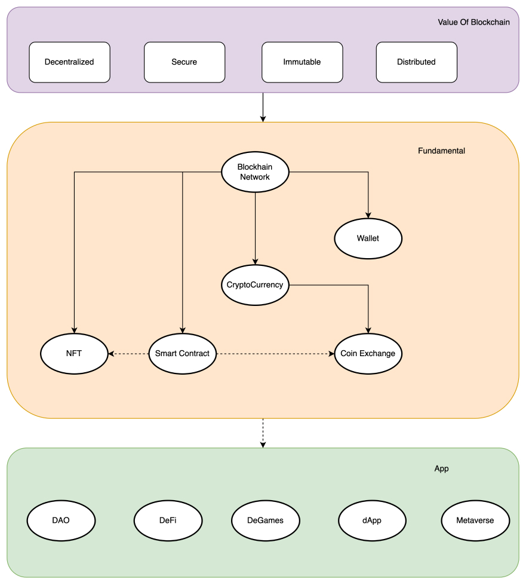
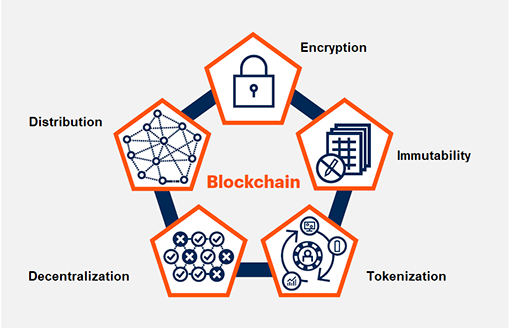
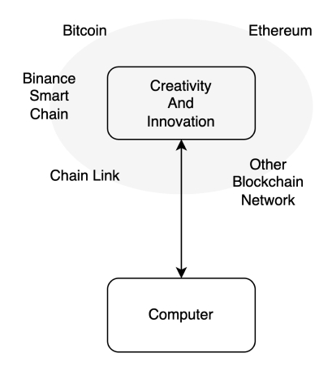
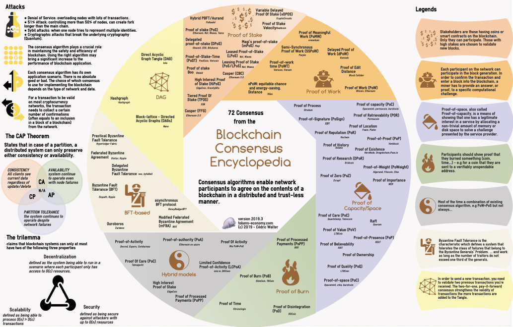
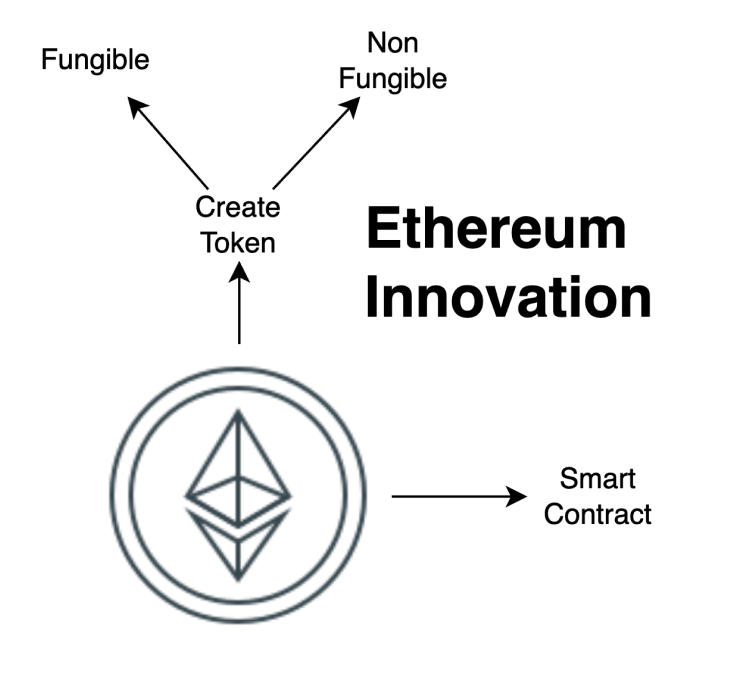
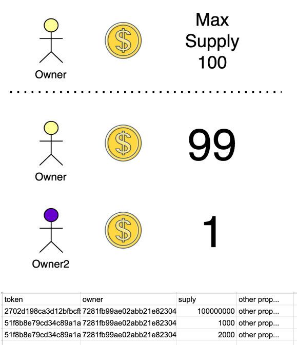
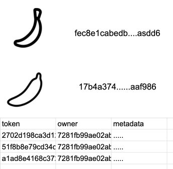
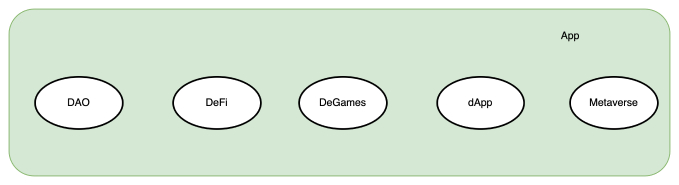

In last month we in Mobile MNC Innovation Center research about web3 from blockchain, we tried to deep dive about web3,  make wallet, mint some NFT, make Smart contract in solidity. here what we find out.

TLDR:

    Web 3.0 it's web, based on blockchain technology. 

---

## #1 Distrupting Money

It start from the idea of bitcoin, a digital money **without one entity of middleman, open and secured by cryptography** techniques, which makes it nearly impossible to double-spend and hack.

### Blockchain

So if you want to make transaction, in order to make that action, all validator have to agree to it after that new transaction added to all validator. wait.. without middle entity? yas it called decentralization, all of it are called blockchain.

The value of blockchain contains five elements: Distribution, encryption, immutability, [tokenization](https://www.gartner.com/en/information-technology/glossary/tokenization#:~:text=Tokenization%20refers%20to%20a%20process,value%20known%20as%20a%20token), and decentralization. When combined, these elements enable organizations to take advantage of the true benefit of blockchain, which is allowing two or more parties who don’t know each other to safely interact in a digital environment and exchange new forms of value and assets. [source](https://www.gartner.com/smarterwithgartner/the-cios-guide-to-blockchain)

### Benefits of decentralization

In blockchain, decentralization refers to the transfer of control and decision-making from a centralized entity (individual, organization, or group thereof) to a distributed network. Decentralized networks strive to reduce the level of trust that participants must place in one another, and deter their ability to exert authority or control over one another in ways that degrade the functionality of the network.

#### Provides a trustless environment

In a decentralized blockchain network, no one has to know or trust anyone else. Each member in the network has a copy of the exact same data in the form of a distributed ledger. If a member’s ledger is altered or corrupted in any way, it will be rejected by the majority of the members in the network. some famous quote

    Trust the truth

#### Improves data reconciliation

Companies often exchange data with their partners. This data, in turn, is typically transformed and stored in each party’s data silos, only to resurface when it needs to be passed downstream. Each time the data is transformed, it opens up opportunities for data loss or incorrect data to enter the workstream. By having a decentralized data store, every entity has access to a real-time, shared view of the data.

#### Reduces points of weakness

Decentralization can reduce points of weakness in systems where there may be too much reliance on specific actors. These weak points could lead to systemic failures, including failure to provide promised services or inefficient service due to the exhaustion of resources, periodic outages, bottlenecks, lack of sufficient incentives for good service, or corruption.

To read more about decentralization go to [AWS page](https://aws.amazon.com/blockchain/decentralization-in-blockchain)

### Hype

With that deck "decentralization but secure currency". crypro has market size of $2T and Hype, source [coinmarket](https://coinmarketcap.com/)

    Recap:
    - Direct Peer to Peer
    - Decentralization
    - Secure
    - Hype

---

## #2 Beginning of Web 3.0

And thats it bitcoin grown until now, it's protocol above many computer in same network to transfer and receive money in secure consensus. while bitcoin serve one purpose. Ethereum guys saw other potential of blockchain network. but wait before go to Ethereum let talk about blockchain network.

### Blockchain Network

Basically blockchain are a group of computer with the same purpose, a computer that has computing power, can store data, And remember it's a computer, you can put innovation and human creativity above it.

How to encrypt, how to secure transaction, how to write a new transaction, called network **blockchain consensus** there are 72 and growing to find out about it go to this [link](https://tokens-economy.gitbook.io/consensus/blockchain-consensus-encyclopedia-infographic), what features of these group of computer can do, called blockchain network.

source [https://tokens-economy....sensus-encyclopedia-infographic](https://tokens-economy.gitbook.io/consensus/blockchain-consensus-encyclopedia-infographic)

### Ethereum

Ok back to Ethereum, in late 2013 Ethereum were created with a goal to build decentralized applications. yas you read it right "application", ethereum has feature to make innovation above blockchain.

If bitcoin decentralization money from central actor, Ethereum is decentralization application from central actor. to make decentralized applications the ethereum has feature call smart contract. you can also make token in ethereum.

### Token (Fungable)

These tokens represent fungible and tradable assets or utilities that reside on their own blockchains. These tokens are usually created, distributed, sold, and circulated through the standard initial coin offering (ICO) process.

If you want to read more about crypto and token please visit article that created by our team [here](https://mobile.mncinnovation.id/blog/what-is-cryptocurrency-and-how-to-create-one/),If yout want to make token there are tool [like this](https://vittominacori.github.io/erc20-generator/create-token/)

### NFT (Non Fungable)

A non-fungible token (NFT) is a non-interchangeable unit of data stored on a blockchain, a form of digital ledger, that can be sold and traded. if it in current world it's like a certificate. the most essential feature of NFT is to server unique and untemperable digital proof for assets based on blockchain.

about nft metadata



#### NFT application

- Proof of Ownership
- Proof of Authenticity
- Proof of Rarity
- Proof of value and liquidity
- Proof for creator to get yield

how to manage, and add program in your digital assets here one feature called smart contract

### Smart Contract

Smart contracts are programs stored on a blockchain to control digital asset that run when predetermined conditions are met. They typically are used to automate the execution of an agreement so that all participants can be immediately certain of the outcome, without any intermediary’s involvement or time loss. They can also automate a workflow, triggering the next action when conditions are met to [read more](https://www.ibm.com/topics/smart-contracts#:~:text=Smart%20contracts%20are%20simply%20programs,intermediary's%20involvement%20or%20time%20loss.)

So you can you add creativity or script to manage digital asset within blockchain. here some example of simple exchange between two let say Etherium and USDC in ethereum network

Smart contract enable exchange between two coin in decentralize way. if you curios about exchange heads up to here [https://mobile.mncinnovation.id/blog/coin-trade/](https://mobile.mncinnovation.id/blog/coin-trade/)

    Recap:
    - Blockchain Network
    - Blockchain Consensus
    - Ethereum
    - Token, NFT and Smart Contract
---

## #3 Web 3

Web 3 is an idea for a new iteration of the World Wide Web based on blockchain technology, which incorporate concepts such as decentralization and token-based economics. found by Gavin wood [https://en.wikipedia.org/wiki/Gavin_Wood](https://en.wikipedia.org/wiki/Gavin_Wood).

Web3 Foundation believes in an internet where:

- Users own their own data, not corporations
- Global digital transactions are secure
- Online exchanges of information and value are decentralized

The mission is to nurture cutting-edge applications for decentralized web software protocols. Our passion is delivering Web 3.0, a decentralized and fair internet where users control their own data, identity and destiny.



Right now the biggest distruption of web3 for builder are in payment and digital assets. Problem with payment that web3 solve are region, permission, and security. The solution behind it is that the payment and underlying technology goes from being a necessary service utility to true peer-to-peer communication channel between the merchant and consumer.

So web3 is movement // idea to take make web on blockchain. here some application of it.

### dApp

A decentralised application is an application that can operate autonomously, typically through the use of smart contracts, that runs on a decentralized computing, blockchain system. Like traditional applications, DApps provide some function or utility to its users.

some example of dApp

- **$AUDIO**, Audius is a music streaming and sharing platform that puts power back into the hands of content creators check [https://audius.co/](https://audius.co/)
- **humanprotocol**, A permissionless protocol to facilitate the exchange of HUMAN work, knowledge, and contribution
- **StorJ**, Storj DCS is secure cloud object storage for developers that's S3-compatible at up to 80% less cost. check [https://www.storj.io/](https://www.storj.io/)

### DeFi

Finanancial services above blockhain, A global, open alternative to the current financial system.
Products that let you borrow, save, invest, trade, and more.
Based on open-source technology that anyone can program with.

Benefit of defi than traditional

|DeFi |Traditional finance|
|-|-|
You hold your money. |Your money is held by companies.
You control where your money goes and how it's spent.|You have to trust companies not to mismanage your money, like lend to risky borrowers.
Transfers of funds happen in minutes.|Payments can take days due to manual processes.
Transaction activity is pseudonymous.|Financial activity is tightly coupled with your identity.
DeFi is open to anyone.|You must apply to use financial services.
The markets are always open.|Markets close because employees need breaks.
It's built on transparency – anyone can look at a product's data and inspect how the system works.|Financial institutions are closed books: you can't ask to see their loan history, a record of their managed assets, and so on.

- Store Value, native in blockhain network, if you want stable value you can store it in gold example [PAXG](https://paxos.com/paxgold/)
- Value Transfer, native in blockhain network
- Lending, example [AAVE](https://aave.com/)
- Borrow, example [AAVE](https://aave.com/)
- _Gadai_, example [AAVE](https://aave.com/)
- Insurance, example [https://etherisc.com/](https://etherisc.com/)
- Trade, example [01](01.xyz), binance, FTX, etc
- Payment Gateway, example [https://solana.com/developers/payments](https://solana.com/developers/payments)
- Crowdfunding, token project, example ASIX

### DeGames

Decentralized gaming can be defined as any game that was built and either operates fully or partially on blockchain technology. most blockhain network are used are for payment, NFT for in game purchase or in game item.

Some notable web3 game

- [https://decentraland.org/](https://decentraland.org/)
- [https://www.fractal.is/](https://www.fractal.is/)
- [https://token.vcgamers.com/](https://token.vcgamers.com/)

Read more about DeGames

### DAO

Decentralized autonomous organizations (DAOs), With DAOs you don’t need to trust anyone else in the group, just the DAO’s code, which is 100% transparent and verifiable by anyone.

Most DAO are use voting mechanism, here's a few examples of how you could use a DAO:

- A charity – you can accept membership and donations from anyone in the world and the group can decide how they want to spend donations.
- A freelancer network – you could create a network of contractors who pool their funds for office spaces and software subscriptions.

DAO are topic hardly to understand for now, while web3 hard to understand there are notable badside from it

---

## #4 Bad side web3

If you have child you and you know the road can cause an accident might dead, you'll tell your child to be carefull right? Here some notable case happened in current web3 project.

- Most of it are speculative

- Energy consumtion for bitcoin and ethereum [source](https://fortune.com/2021/10/26/bitcoin-electricity-consumption-carbon-footprin/#:~:text=The%20report%20states%20that%20each,of%20electricity%20that%20costs%20%24176.)

- Network might not safe, "[an exchange hack blockhain network](https://techcrunch.com/2018/02/12/bitgrail-hack-nano/)"

- The idea of "decentralization" are still far, "[Crypto Wallet block access to some country](https://decrypt.co/94316/opensea-iran-users-claim-blocked-ethereum-nft-marketplace)"

- Developer can write bad smart contract
[Mint Glitch](https://www.theblockcrypto.com/post/138934/stablecoin-cashio-on-solana-exploited-for-28-million-in-infinite-mint-glitch)

- Developer can write bad smart contract 2
[SQUID Game](https://librehash.org/squid-token-rug-pull-analysis-entire-crypto-space-needs-to-pay-attention/)

- NFT are not verifyable, [Twitter Case](https://twitter.com/HollanderAdam/status/1484246971208642577)

- NFT Stolen art, [The verge](https://www.theverge.com/22905295/counterfeit-nft-artist-ripoffs-opensea-deviantart)

- Stolen IP $innuyasha [Token INNUYASHA](https://yashadao.io/)

Other
There are some other article, talk, and documentary you might like here

- Collection Articles and total scam thath happen in web 3 [web3isgoinggreat.com](https://web3isgoinggreat.com/)

- YT- The line goes up [YouTube](https://www.youtube.com/watch?v=YQ_xWvX1n9g&t=1111&ab_channel=FoldingIdeas)

- [Indonesia] - Podcast about sceptism on web3 [Google Podcast](https://podcasts.google.com/feed/aHR0cHM6Ly9hbmNob3IuZm0vcy85MWNiYmIwL3BvZGNhc3QvcnNz/episode/ZWVmOTdiMzMtZGRhYi00Yzk1LTk1NjctNTRhZjU3YmI0ZGIz?sa=X&ved=0CAUQkfYCahcKEwiYod6Q4un2AhUAAAAAHQAAAAAQAQ)

---

## #5 What in it for developer

Above all hype, what in it for builder or develepor like us

- if you code and make application on blockchain, you not pay for blockchain infrastructure
- if you have infra, you get insentive by b

## Conclusion

Bitcoin network are created to make financial distruption, the idea of decentralization and peer to peer are grow and adopted by ethereum to decentralization applicaiton and it feature to make blockchain accesible to many opportunity and application today. is it scam?, is it the future? i don't know, but it already created hype, opportunity, accesibility, wealth creation and innovation.

---

## Source

Garthner the real business of blockchain

https://aws.amazon.com/blockchain/decentralization-in-blockchain

https://www.weforum.org/agenda/2022/02/web3-transform-the-internet/

Varios page of wikipedia

https://ethereum.org/en/defi/

