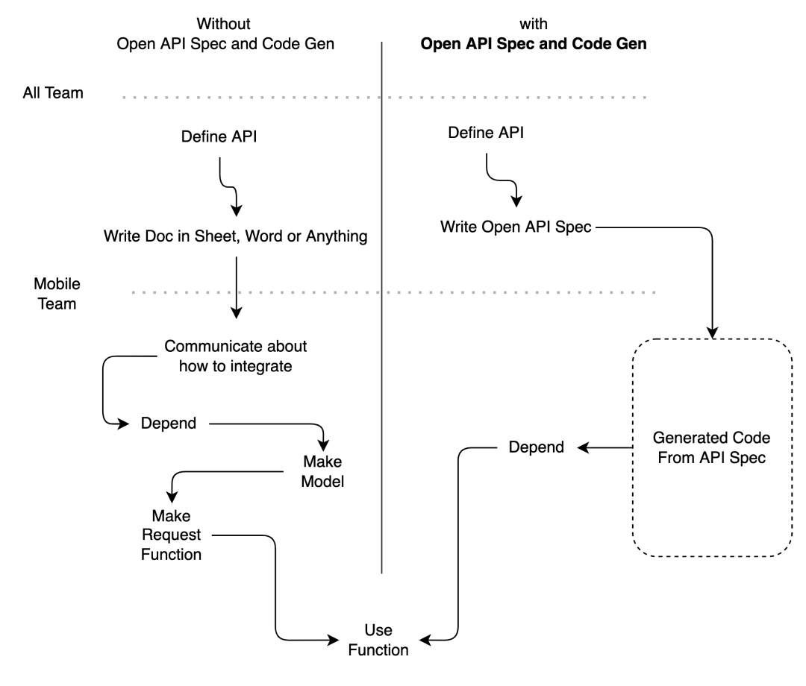
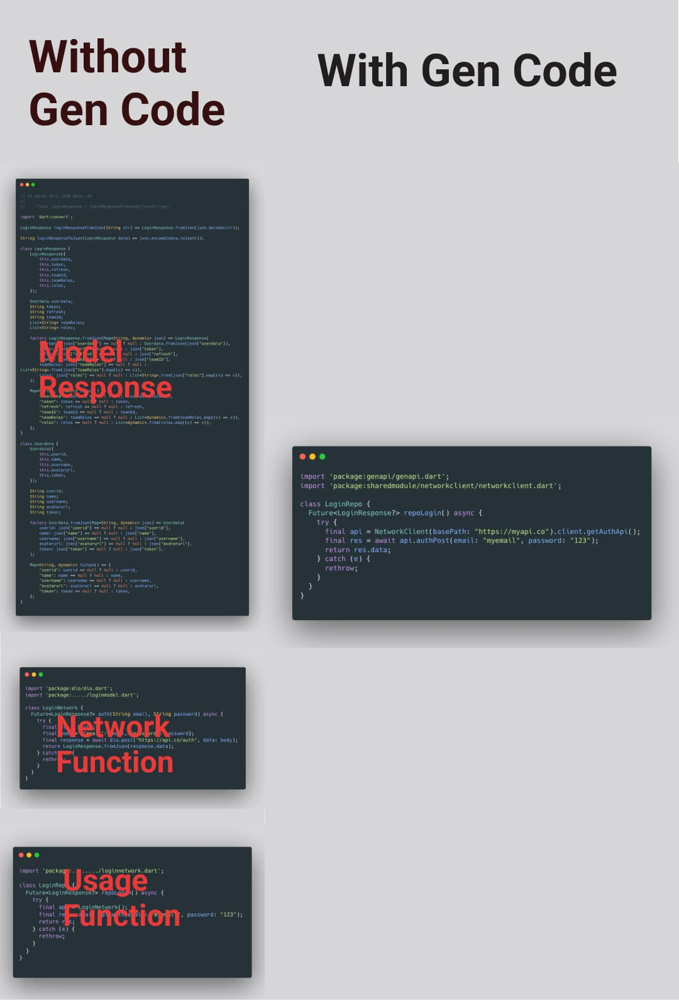
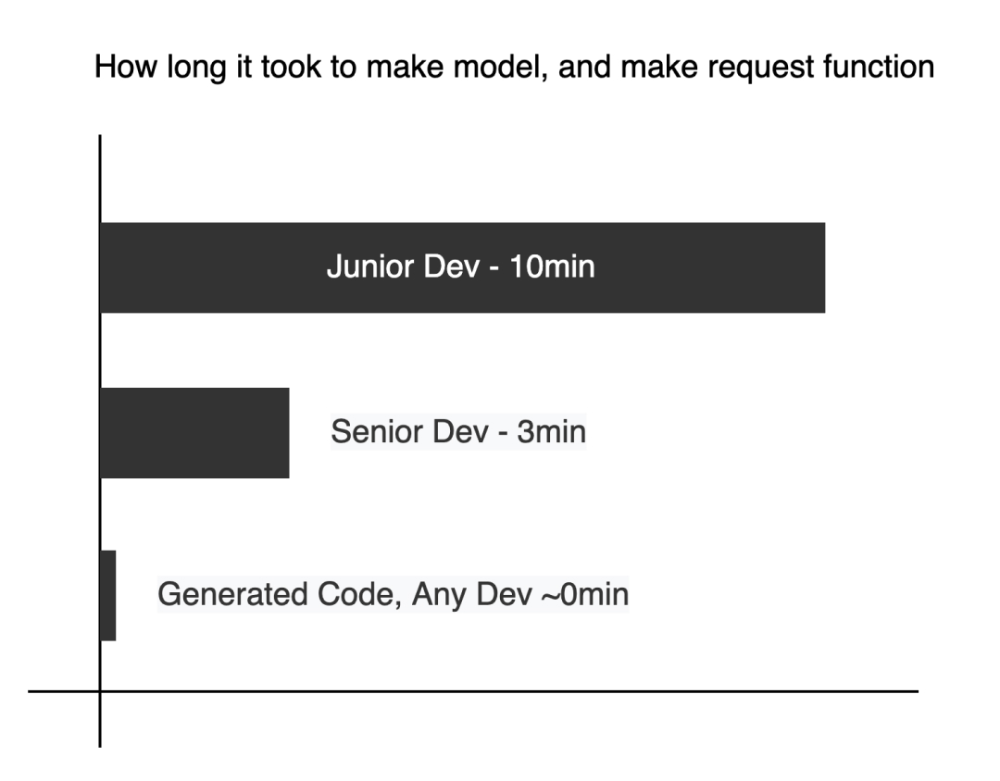

One of protocol to connect mobile app to server is via REST API. But it is not always easy to write code for REST API. It requires knowledge of HTTP and JSON. And to integrate between backend and mobile app require some code.

## Integration problem

Common conflict or drama when integration happen

- Wrong TYPE!, int become string, boolean become 1 or 0. Etc
- Wrong Method, GET/POST, POST or PUT?
- Typo when request
- No Standard

Most of conflict happen cause human error, communication, and no standard applied when integration happen.

## OPEN API Spec

The OAS defines an open standard for RESTful APIs, which is a specification for how to use HTTP requests and responses to communicate with web services. The OAS provides guidance on how to structure an API, as well as how to interact with it using HTTP requests and responses. The OAS also describes how to generate code that can be used to interact with the API.



The spec will make standard for

- Standard HTTP Status Code
- Path
- How response data component like
- HTTP Security Standard

And other standard you can found out [here](https://spec.openapis.org/oas/latest.html)

### Integration with spec

This simple diagram show how integrate with Rest API and use it in mobile application

How it look in code

Number of line of code in our code base.

|                                  | Line Of Code                                                                                                           |
| -------------------------------- | ------------------------------------------------------------------------------------------------------------------------------------------ |
|Not using generator|>100 line|
|Using generator| **14** line |

Code generator are done with open-api-generator is a tool to generate the OpenAPI specification for an existing RESTful API. We can generate to those:

|                                  | Languages/Frameworks                                                                                                                |
| -------------------------------- | --------------------------------------------------------------------------------------------------------------------------------------------------------------------------------------------------------------------------------------------------------------------------------------------------------------------------------------------------------------------------------------------------------------------------------------------------------------------------------------------------------------------------------------------------------------------------------------------------------------------------------------------------------------------------------------------------------------------------------------------------------------------------------------------------------------------------------------------------------------------------------------------------------------------------------------------------------------------------------------------- |
| **API clients**                  | **ActionScript**, **Ada**, **Apex**, **Bash**, **C**, **C#** (.net 2.0, 3.5 or later, .NET Standard 1.3 - 2.1, .NET Core 3.1, .NET 5.0. Libraries: RestSharp, GenericHost, HttpClient), **C++** (Arduino, cpp-restsdk, Qt5, Tizen, Unreal Engine 4), **Clojure**, **Crystal**, **Dart**, **Elixir**, **Elm**, **Eiffel**, **Erlang**, **Go**, **Groovy**, **Haskell** (http-client, Servant), **Java** (Apache HttpClient, Jersey1.x, Jersey2.x, OkHttp, Retrofit1.x, Retrofit2.x, Feign, RestTemplate, RESTEasy, Vertx, Google API Client Library for Java, Rest-assured, Spring 5 Web Client, MicroProfile Rest Client), **k6**, **Kotlin**, **Lua**, **Nim**, **Node.js/JavaScript** (ES5, ES6, AngularJS with Google Closure Compiler annotations, Flow types, Apollo GraphQL DataStore), **Objective-C**, **OCaml**, **Perl**, **PHP**, **PowerShell**, **Python**, **R**, **Ruby**, **Rust** (hyper, reqwest, rust-server), **Scala** (akka, http4s, scalaz, sttp, swagger-async-httpclient), **Swift** (2.x, 3.x, 4.x, 5.x), **Typescript** (AngularJS, Angular (2.x - 11.x), Aurelia, Axios, Fetch, Inversify, jQuery, Nestjs, Node, redux-query, Rxjs) |

Find out about code generation on [Github](https://github.com/OpenAPITools/openapi-generator) or [their website](https://openapi-generator.tech/)

### Productivity Impact

The time it took to write function, write model, and define how to integrate. With Generated Code from Open API anyone don’t have to write it again.

#### Less Maintain

In fact we don’t have to maintain the code of network integration. If something bad happens in generation tool, worry less since Open API Spec are open global standard. and code generator tool are open source mean that everyone can contribute, make issue, and make copy of existing tool.

#### Future Proof

Tech change often when there are new tool to build mobile app and we migrate to it, the current spec are same and we can reuse the generated code. So we don’t have to write network integration again.

#### Team Effort

To implement open api is team effort. We need to work together, discuss and make decisions. I Hope that everyone can understand the good impact of OPEN API Standard

### Learn

You can learn about OPEN API here

Indonesia


English


### Conclusion

OPEN API Spec and generated code will make easier to integrate between server and mobile app. Cause it add standard to api. I hope it become standard to consume Rest API across MNC GROUP.
