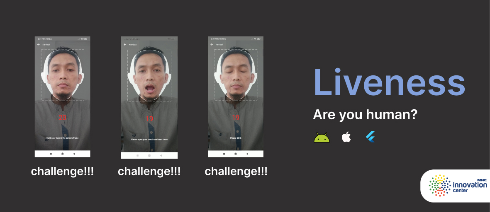
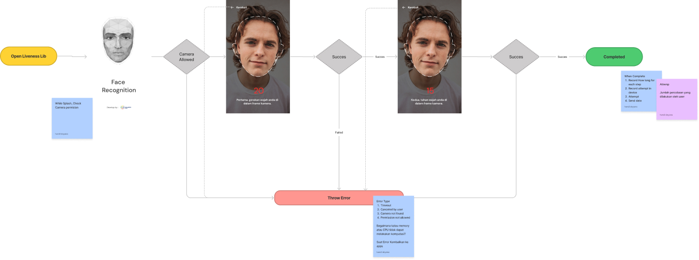
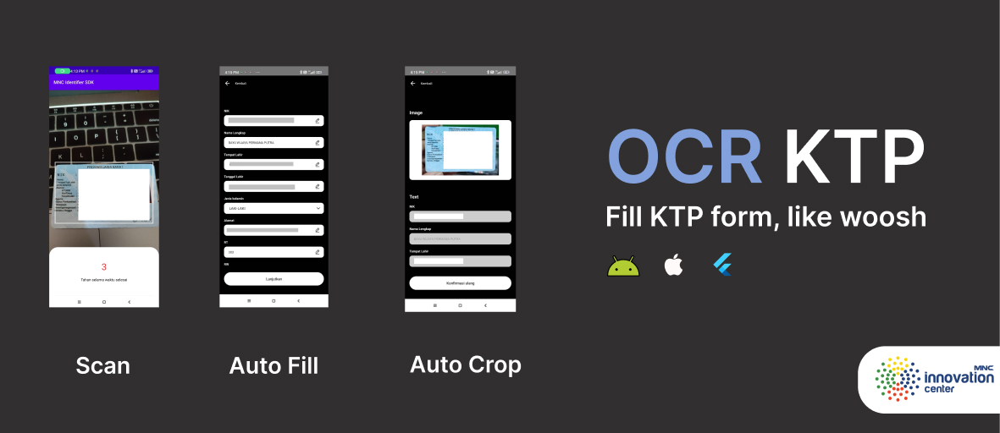
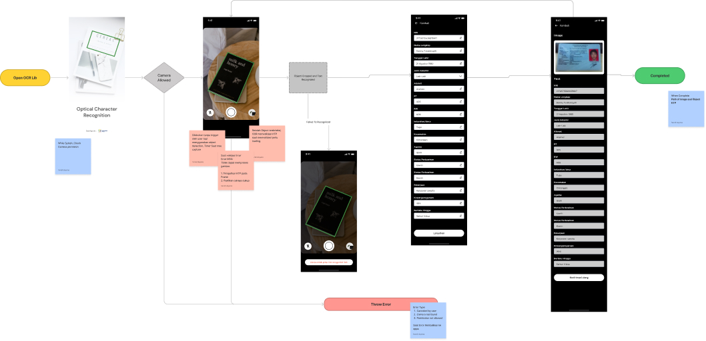

There are two lib two library available today

1. [Liveness identifier](#liveness)
2. [KTP (Indonesia ID) OCR identifier](#ktp-ocr)

All of these library are free, and open source you

## Liveness

This library created to make sure the user are **human** not bot, to verify that user are human, there are several challange for user to complete, like:

- Smile
- Nod
- Tilt
- Close eye
- Open mouth

The challange are randomly test to user so every user has different experience. User will ask twice to complete the challange. here are the journey for user.

### Experience and flow

We recommend to test the liveness of user for the first time when user start KYC jurney

[Click here](flow_lv_full.jpeg) to view full image

The experience are

1. Splash screen
It's show a image while it shown, we ask for camera permision.
2. User are chalange for several time untill it success

### Liveness Error

There are several error that anticipated such:

- Timeout
- Canceled by user
- Camera not found
- Permission not allowed

When error occured, the lib will return to your app.
Should you block user? or should you temporary disable registration? it's on you.

### Get started

- [Android](https://github.com/mncinnovation/mnc-identifiersdk-android)
- [iOS](https://github.com/mncinnovation/mnc-identifiersdk-ios)
- Flutter (Coming soon)

---

## KTP OCR

KTP OCR are sdk to read user identity based on user KTP, this library aim to deliver great experience to user, so user dont have to fill data again. the AI generated data may not 100% accurate so user can re edit the auto filled to make sure the is correct one.

Here some available data that this sdk read:

- nik
- name
- tempat lahir
- tanggal lahir
- golongan darah
- alamat
- rt
- rw
- kelurahan
- kecamatan
- status perkawinan
- pekerjaan
- kewarganegaraan
- provinsi
- kab/kota
- berlaku

### Experience and flow

[Click here](flow_ktp_full.jpeg) to view full image

The experience are:

- Splash screen

    It's show a image while it shown, we ask for camera permision.

- User ask for scan its ID

    While it scanning our AI detech KTP Object, to define KTP we detect it wih "NIK" keyword in card and face.

    Flash by default are disabled because KTP surface are glossy and it will make text not readable. therfore you can enable or disable it in the codebase.

- Editable filled form

    After user scan ktp it will shown filled form from previous scan, this are editable cause AI will not make 100% acuracy and this also oportunity for user to verify AI result

- Confirmation Page

    User will shown cropped KTP and Filled KTP data, this shown to minimize human error.

### OCR Error

There are serveral expected error

- Canceled by user
- Camera not found
- Permission not allowed

### Get Started

- [Android](https://github.com/mncinnovation/mnc-identifiersdk-android)
- [iOS](https://github.com/mncinnovation/mnc-identifiersdk-ios)
- [Flutter](https://github.com/mncinnovation/mnc_identifier_ocr)
