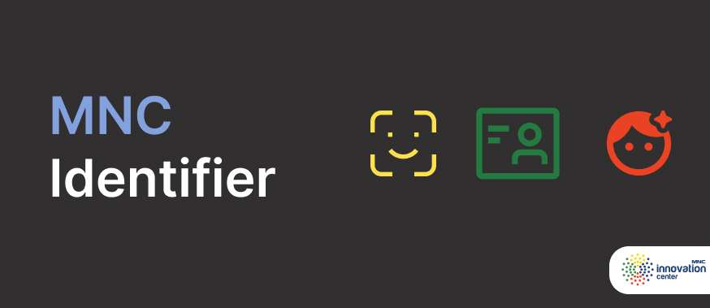

## MNC Identifier

Identifier SDK are set of SDKs to identify user with AI and ML in mobile application

it has these feature:

- Human liveness
- Indonesia ID (KTP) OCR

All of these feature are free

## MNCApps

| | |
| --- | -------- |
| |SDK to help you discover, and manage all MNC Apps to display it on your application [Get Started](../../mncapps/cms/) |

it has features:

- Manage Apps
- Customize Layout
- Customize Apps Order
- Manage Click Behaviour
