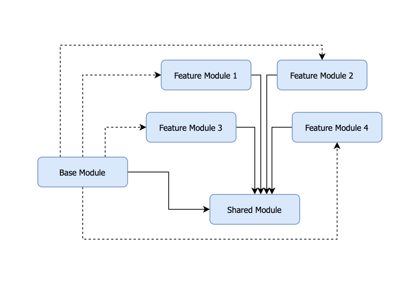
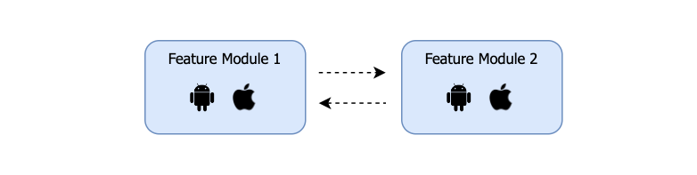
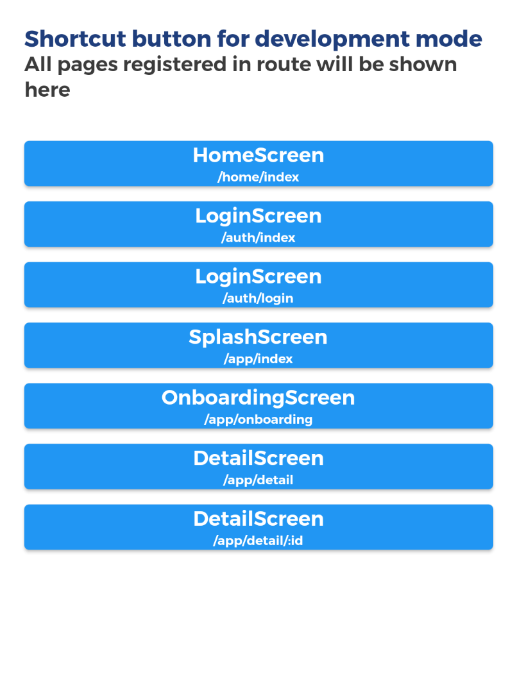

## Intro

Developing a super app is a quite complex and usually involves many people. In addition, as developers we also have to think about easy ways to do maintenance or add new features to applications that are already running in the long term, without having to cause new issues to become more complex. In this case, we can use microflutter to split a large project into smaller parts to be flexible and focus on what is currently working.

## Architecture

Separating features from other features into smaller ones is also known as the concept of modularization. Modularization is a practice of organizing a codebase into [loosely coupled](https://en.wikipedia.org/wiki/Coupling_(computer_programming)) and self contained parts (module). By dividing the problem into smaller parts, you can reduce the complexity and error issues that can occur when there is a code change at any time. 

After doing research and experiments using flutter, we finally created a new standard for modular in mobile applications by improving from the previous [monolith standard](https://mobile.mncinnovation.id/standard/flutter/boilerplate/), it also means that we can convert an existing monolith project into a modular one, and vice versa (with some adjustments).

Basically we separate the system/application into three main parts:

| Name   |      Description  |
|----------|:-----------|
| **Base Module** |  Main module that runs all the features |
| **Feature Module** |    Modules for features and are flexible, can be added as needed and do not depend on other features   |
| **Shared Module** | Contains some common components and widgets for all modules |

Inspired by the microservice framework, this architecture can also be applied to flutter, each **Feature Module** can run with a runner on each platform on android and ios, that means each feature can be considered as a flutter project on its own and can stand alone without having to run through the **Base Module**. Then to be able to connect and interact with each other, we can add modules (load) flexibly or it can also be done by adding an interface/helper bridge in the **Shared Module**.



## Routing

To move navigation from a page, we can combine the path module and the route path of the registered page, for example:

```dart
class AuthModule extends ModularChild {
  @override
  String get modulePath => "/auth";

  @override
  Map<String, Widget> get routes => {
        "/login": const LoginScreen(),
      };
}
```

From the code above, to go to the login page we can use the function from **Getx** or **RouteHelper** as follows:

```dart
// module path + route path
Get.toNamed("/auth/login"); 
// or
RouteHelper.toPage("/auth/login");
```

### Show all route page

You can display all routes registered in your module when the application is run by changing the value of **showDevShortcut** to **true** in the main.dart file.



## Dependency

Each module from **feature**, **base**, or **even** shared has its own runner which is initiated via **main.dart**, everything defined in the main.dart file will not affect each other module, that means it only applies to that module when the module is run.

### Global binding

One of the things that is quite important from the architecture of an application is [dependency injection](https://en.wikipedia.org/wiki/Dependency_injection) or DI, by using DI, then the process of creating an instance of an object or component can be easily separated, and when the time is needed we just call it without having to create the object again.

> In software engineering, **dependency injection** is a design pattern in which an object or function receives other objects or functions that it depends on. (wikipedia)
> 

An example of its application can be seen from the use of the network function, we can create an object instance and add environment variables to it, at the start of running the application.

```dart
@override
void globalBinding(i) {
	bind(AppNetworkClient(baseurl: AppEnvironment.baseURL));
}
```

The code in the global binding will be initiated when the module is accessed (for modules that are loaded externally, the global binding function is called only that extends the class from ModularChild while ModularApp does not, because it stands alone), while for **bind** serves to create a [singleton](https://en.wikipedia.org/wiki/Singleton_pattern) object that can be called from other places.

```dart
final AppNetworkClient _networkClient = Get.find();
```

In addition to **bind** which creates an instance of the function once when the app is first run, you can also create a function that creates an instance only when prompted using **lazyBind**.

### Load external module or feature

Each module should ideally have one repository in git, so when a new developer joins, he will only be assigned to the repository he needs.

The repository can also be linked directly to the flutter project via pubspec remotely. However, for every change that is pushed to an external module, we must add the version so that it can be updated, or we can simply by remove and re-add the module in pubspec. For development it is quite time consuming, so during development we can override by directing external modules to local computers to make it simpler and faster when there is a code change from the external module (for adding files, usually just run the command **flutter pub get**) .

**Local**

```yaml
dependency_overrides:	
	feature_module:
		path: ../feature_module # to your folder path
```

To avoid conflict, use “dependency overrides" to choose local path instead.

**Remote**

```yaml
	feature_module:
		version: <version_code> # opsional
		git:
			url: <git_repository_url>
			ref: <specify_branch> # or commit hash
```

If dependencies are not updated due to cache, run **flutter pub get** or **flutter packages get** (In case you use remote git repository dependency, maybe you should remove and re-add module [https://stackoverflow.com/a/55399559](https://stackoverflow.com/a/55399559)).

## Widgets / Features

### Show Image

To display image assets on a slightly different microflutter architecture than monolith, we need to add the package/module name next to the path (unless run from the module itself). Fortunately, we've added a LocalImage class file (local_image.dart) for calling image assets from the Feature/Base module. For image assets from Shared Modules, you can use SharedImage (shared_image.dart).

```dart
// Show from local image asset
LocalImage(
	"assets/logo/logo.png", // support for svg too
	fromModule: "modul_name"
)

// Show from shared image asset
SharedImage(
	"assets/logo/logo.png"
) 
```

### Translations

Each module has a json file to store a collection of strings which will later be translated into other languages according to the localization set by the device. The string that is entered into json needs to be generated manually so that it can be used/imported in the view section using the following command:

```
flutter pub run fast_i18n
```

For more details on how to use this fast_i18n package, you can see the full documentation [here](https://pub.dev/documentation/fast_i18n/latest/) (This package is discontinued, alternatively you can use [slang](https://pub.dev/packages/slang)).