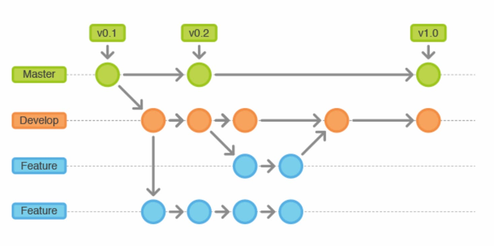
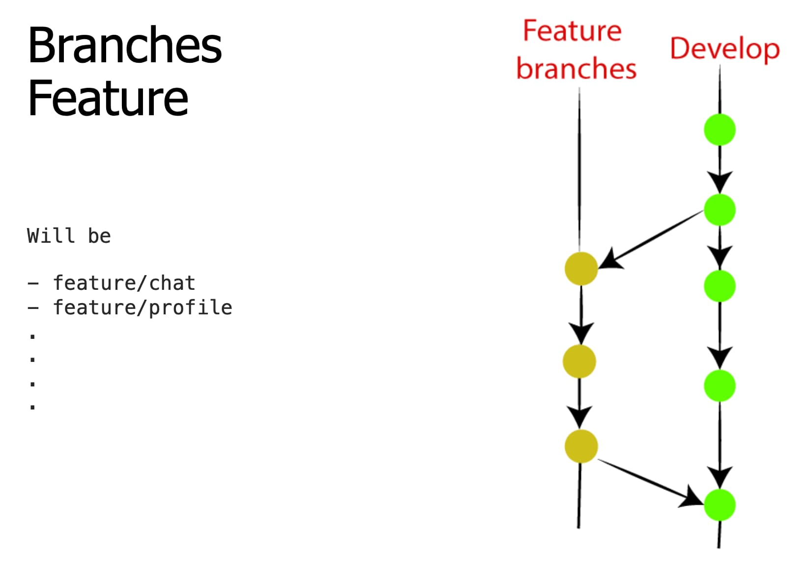
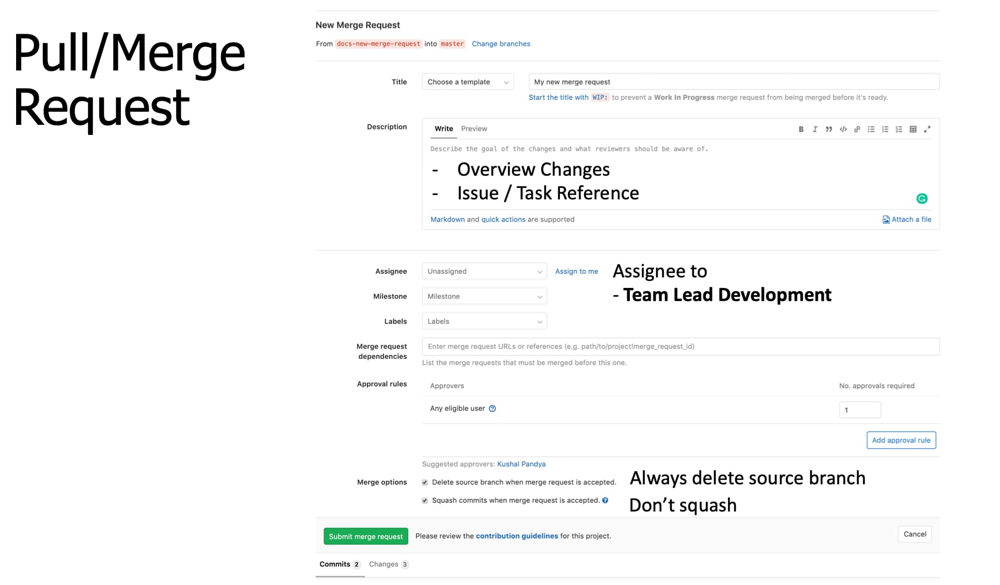

Since developers has different git knowledge and git has many workflow like Centralized Workflow, Feature Branch Workflow, Gitflow, and Forking Workflow, to make collaboration within team run smoothly there are standard workflow that every mobile innovation center project MUST follow.

## Git Feature Branch Workflow

{{}}

The core idea behind the Feature Branch Workflow is that all feature development should take place in a dedicated branch instead of the  `master/main`  branch. This encapsulation makes it easy for multiple developers to work on a particular feature without disturbing the main codebase. It also means the  `master/main`  branch will never contain broken code, which is a huge advantage for continuous integration environments.

## Branch name

{{}}

Feature branches should have descriptive names like

- feature/animated-menu
- feature/login
- fix/issue-#1061
- hotfix/typo

The idea is to give a clear, highly-focused purpose to each branch.

## Merge Request

{{}}

- Overview change in desc
- Assign to lead dev
- Delete source
- Don't squash

Encapsulating feature development also makes it possible to leverage merge requests, which are a way to initiate discussions around a branch. They give other developers the opportunity to sign off on a feature before it gets integrated into the official project. Or, if you get stuck in the middle of a feature, you can open a merge request asking for suggestions from your colleagues. The point is, merge requests make it incredibly easy for your team to comment on each other’s work.

## Commit

### When to commit

1. Commit early, commit often
2. Commit when it has changes to data, function, assets or object
3. make sure there’re no errors before committing

Don't

- Don’t commit whitespace changes, please!
- Don't commit commented code

### Commit message

- feat: The new feature you’re adding to a particular application
- fix: A bug fix  
- style: Feature and updates related to styling  
- refactor: Refactoring a specific section of the codebase
- test: Everything related to testing  
- docs: Everything related to documentation
- BREAKING-CHANGE!:

Based on [conventionalcommits.org](https://www.conventionalcommits.org/en/v1.0.0/)

### Commit Example

- git commit -m 'Fix:added y to x’  
- git commit -m ‘Fix:Typo in readme.md’  
- git commit -m ‘refactor:drop support for iOS 8’  
- git commit -m ‘docs: correct spelling of CHANGELOG’

## Tagging

- Tag specific points in a repository’s history as being important.  
- Tag should ideally be created by team lead development once the app is released in store.
- When tagging releases in a version control system, the tag for a version MUST be "vX.Y.Z" e.g. "v3.1.0".

## Mobile Best Practice

- Recommend to Use Git GUI Client
